> [!TIP]
>
> 笔记主要内容：学习SLAM十四讲，自动驾驶与机器人中的SLAM技术，以及C++编程的基础知识，侧重于**代码，代码结合理论的学习笔记**

# C++ Basic

## Hello world

使用VS Code配置C++运行程序，要安装C++的扩展（VS Code中搜索即可），以及g++编译器。

```shell
sudo apt-get update
sudo apt-get install gcc
sudo apt-get install g++
sudo apt-get install gdb
```

配置编译器：在`ctrl+shift+p`选择g++编译器，生成`.vscode`文件夹，下面含有`task.json`，里面就是项目的编译器配置。

编译运行程序：先编译，后运行。

```bash
g++ example.cpp -o example
./example

# 默认编译 example.cpp 并生成可执行文件，输出文件的默认名称是 a.out
g++ example.cpp
./a.out
```

也可以使用`code Runner`插件直接运行C++程序，但是个人感受可以多尝试编译运行，比较清晰，直接运行会有很多步骤，不一定看的清楚。

如果是有自己编写的头文件库，引用了`.cpp`文件，需要同时编译所有的`.cpp`文件

```bash
g++ useHello.cpp libHelloSLAM.cpp -o useHello
```

## cmake

当程序库关系复杂，`g++`命令非常繁琐，因此使用`cmake`来构建C++工程。

安装`cmake`

```shell
sudo apt update
sudo apt install cmake
```

`CMakeLists.txt`

```shell
# 最低版本要求
cmake_minimum_required(VERSION 3.10)

# 定义项目名称和版本
project(HelloSLAM)

# 设置 C++ 标准
set(CMAKE_CXX_STANDARD 11)
set(CMAKE_CXX_STANDARD_REQUIRED True)

# 添加可执行文件
add_executable(helloSLAM helloSLAM.cpp)
```

`cmake`目录结构

```objective-c
project_directory/
├── CMakeLists.txt
└── example.cpp
```

同时，使用`cmake`命令会产生创建工程，编译项目的文件，一般创建`build`文件夹来存储，方便管理。

```bash
mkdir build
cd build
cmake .. # 表示对上一级目录的文件夹执行cmake，处理工程文件中的关系
make # 调用g++来编译C++程序
```

`add_library`是 CMake 中用于定义和创建一个库的命令。这个库可以是静态库或共享（动态）库，并且可以在同一项目中被其他目标（如可执行文件或其他库）使用。

```cmake
add_library(<name> [STATIC | SHARED | MODULE] [EXCLUDE_FROM_ALL]
            <source1> <source2> ... <sourceN>)
add_library(hello_shared SHARED libHelloSLAM.cpp)  # 共享库
```

1. **`<name>`**
   - 指定库的名称，用于其他目标链接到此库，例如在 `target_link_libraries` 中。
2. **`STATIC | SHARED | MODULE`**（可选）：
   - **`STATIC`**：创建静态库（`.a` 或 `.lib`）。
   - **`SHARED`**：创建共享（动态）库（`.so`、`.dll`、`.dylib`）。
   - **`MODULE`**：创建一个模块库，通常用于在运行时动态加载的库。
   - 如果不指定，默认行为由 `CMAKE_LIBRARY_OUTPUT_DIRECTORY` 和 `CMAKE_ARCHIVE_OUTPUT_DIRECTORY` 控制。
3. **`EXCLUDE_FROM_ALL`**（可选）：如果指定，库不会被默认构建。必须显式构建或链接到目标中。
4. **`<source1> <source2> ... <sourceN>`**：指定构成库的源文件，可以是 `.cpp`、`.c` 或 `.h` 文件等。

**静态库，共享库，模板库对比**：总体上，共享库和模板库基本一样，只是模板库功能更强大。

| 特性           | 静态库                       | 共享库                       | 模块库                     |
| -------------- | ---------------------------- | ---------------------------- | -------------------------- |
| **扩展名**     | `.a`, `.lib`                 | `.so`, `.dll`, `.dylib`      | `.so`, `.dll`, `.dylib`    |
| **链接阶段**   | 静态链接，嵌入可执行文件     | 动态链接，运行时加载         | 动态加载，运行时由程序管理 |
| **运行时依赖** | 无需库文件                   | 需要库文件                   | 需要库文件                 |
| **内存使用**   | 每个可执行文件都有库的副本   | 多个程序共享同一份库         | 与共享库相同               |
| **更新维护**   | 需要重新编译可执行文件       | 更新库无需重新编译           | 更新模块无需重新编译       |
| **优点**       | 独立性强，简单易用           | 节省内存和存储空间，易于维护 | 支持插件系统，灵活性高     |
| **缺点**       | 增加可执行文件大小，更新不便 | 运行时依赖，需管理库版本     | 增加运行时复杂性和调试难度 |

总体上，`CMakeLists.txt`的模板如下

```cmake
# 声明要求的 cmake 最低版本
cmake_minimum_required(VERSION 2.8)

# 声明一个 cmake 工程
project(HelloSLAM)

# 设置 C++ 标准
set(CMAKE_CXX_STANDARD 11)
set(CMAKE_CXX_STANDARD_REQUIRED True)

# 设置编译模式
set(CMAKE_BUILD_TYPE "Debug")

# 添加hello库
# add_library(hello libHelloSLAM.cpp)  # 不指定库类型
add_library(hello_shared SHARED libHelloSLAM.cpp)  # 共享库

# 添加可执行程序调用hello库中函数
add_executable(useHello useHello.cpp)
# 将hello_shared库文件链接到可执行程序useHello上
target_link_libraries(useHello hello_shared)
```

## C++ 类

在C++中，类（class）是面向对象编程的核心结构，用于封装数据和操作数据的方法。下面是一个简单的C++类的示例，包括类的定义、成员变量、构造函数、成员函数等内容：

### 一个基本的类定义

```C++
#include <iostream>
#include <string>
using namespace std;

// 定义类
class Person {
private:
    // 私有成员变量
    string name;
    int age;

public:
    // 默认构造函数
    Person() : name("Unknown"), age(0) {}

    // 带参数的构造函数
    Person(string n, int a) : name(n), age(a) {}

    // 设置姓名
    void setName(string n) {
        name = n;
    }

    // 获取姓名
    string getName() const {
        return name;
    }

    // 设置年龄
    void setAge(int a) {
        if (a >= 0) {
            age = a;
        } else {
            cout << "Invalid age!" << endl;
        }
    }

    // 获取年龄
    int getAge() const {
        return age;
    }

    // 显示信息
    void display() const {
        cout << "Name: " << name << ", Age: " << age << endl;
    }
};

// 主函数
int main() {
    // 使用默认构造函数
    Person person1;
    person1.display();  // 想要访问类中的私有变量，只能通过内部定义的display方法进行访问

    // 使用带参数的构造函数
    Person person2("Alice", 25);
    person2.display();

    // 修改属性
    person2.setName("Bob");
    person2.setAge(30);
    person2.display();

    return 0;
}
```

### 代码说明

1. **成员变量和访问权限**:
   - `private`: 只能被类的内部访问，通常用于保护数据。
   - `public`: 可以被外部访问，用于对外提供接口。
2. **构造函数**:
   - 默认构造函数 `Person()`: 在创建对象时初始化默认值。
   - 带参数的构造函数 `Person(string n, int a)`: 允许直接传入参数来初始化对象。
3. **成员函数**:
   - 用于操作类的成员变量，比如 `setName()` 和 `getName()`。
   - 使用 `const` 修饰的成员函数（如 `getName()` 和 `display()`）表示该函数不会修改类的成员变量。
4. **函数重载**:
   - 构造函数被重载为多个版本，满足不同的初始化需求。
5. **访问对象的成员**:
   - 使用对象名和点运算符 `.` 访问类的成员函数。

### 输出结果

```yaml
Name: Unknown, Age: 0
Name: Alice, Age: 25
Name: Bob, Age: 30
```

## 模板语法

模板示例

```C++
template<typename T>
```

在模板中，`T` 是一个占位符，代表某种数据类型。通过模板，可以用相同的代码**实现对不同数据类型的处理**，而无需重复编写类似功能的代码。

具体的含义

- `T` 可以在函数、类或结构体中表示某种类型（基本数据类型如 `int`、`double`，也可以是自定义的类）。
- `typename` 是关键字，用于声明模板参数为类型（可以用 `class` 替代，功能相同）。
- 当模板实例化时，`T` 会被替换成实际的类型。

### **示例 1：模板函数**

```C++
template<typename T>
T add(T a, T b) {
    return a + b;
}

int main() {
    std::cout << add(1, 2) << std::endl;       // 实例化为 int 类型的函数
    std::cout << add(1.5, 2.5) << std::endl;   // 实例化为 double 类型的函数
    return 0;
}
```

**解析：**

- `add` 是一个模板函数。
- `T` 是模板参数，表示 `add` 可以操作任意类型（如 `int`、`double` 等）。
- 当调用 `add(1, 2)` 时，编译器实例化 `add<int>(int a, int b)`。
- 当调用 `add(1.5, 2.5)` 时，编译器实例化 `add<double>(double a, double b)`。

## 上锁

### 基本概念

在C++中，“对变量上锁”通常是指在多线程编程中，使用同步机制保护共享变量或资源，以防止多个线程同时访问或修改该变量而导致数据竞争（Data Race）或不一致的情况。

“上锁”是一种确保**线程安全性**的操作，主要目的是：

1. **防止数据竞争**：当多个线程同时访问和修改同一变量时，上锁可以确保只有一个线程能够在某一时刻对变量进行操作。
2. **保证数据一致性**：通过上锁确保线程按照预期顺序访问共享变量，避免读取不完整或错误的数据。

### 实现上锁

在C++中，可以使用多种方式对变量上锁：

#### 使用 `std::mutex`

C++11 引入了 `std::mutex`，它是一种互斥锁，用于保护共享资源。在这个例子中，`mtx.lock()` 和 `mtx.unlock()` 确保了对 `sharedVariable` 的访问是线程安全的。

```C++
#include <iostream>
#include <thread>
#include <mutex>

std::mutex mtx; // 定义一个互斥锁
int sharedVariable = 0; // 共享变量

void increment() {
    mtx.lock(); // 上锁
    ++sharedVariable; 
    std::cout << "Thread " << std::this_thread::get_id() << ": " << sharedVariable << std::endl;
    mtx.unlock(); // 解锁
}

int main() {
    std::thread t1(increment);
    std::thread t2(increment);
    t1.join();
    t2.join();
    return 0;
}
```

#### **使用 `std::lock_guard`**

`std::lock_guard` 是 C++11 提供的一个 RAII（资源获取即初始化）风格的锁管理工具，它会在构造时上锁，在析构时自动解锁，减少了忘记解锁的风险。

```C++
#include <iostream>
#include <thread>
#include <mutex>

std::mutex mtx; 
int sharedVariable = 0;

void increment() {
    std::lock_guard<std::mutex> lock(mtx); // 自动上锁并在作用域结束时解锁
    ++sharedVariable;
    std::cout << "Thread " << std::this_thread::get_id() << ": " << sharedVariable << std::endl;
}

int main() {
    std::thread t1(increment);
    std::thread t2(increment);
    t1.join();
    t2.join();
    return 0;
}
```

#### **使用 `std::unique_lock`**

`std::unique_lock` 提供了比 `std::lock_guard` 更灵活的锁管理功能。例如，可以延迟上锁、手动解锁/重新上锁等。

```C++
#include <iostream>
#include <thread>
#include <mutex>

std::mutex mtx; 
int sharedVariable = 0;

void increment() {
    std::unique_lock<std::mutex> lock(mtx); // 上锁
    ++sharedVariable;
    std::cout << "Thread " << std::this_thread::get_id() << ": " << sharedVariable << std::endl;
    lock.unlock(); // 提前解锁
}

int main() {
    std::thread t1(increment);
    std::thread t2(increment);
    t1.join();
    t2.join();
    return 0;
}
```

## 调试


# SLAM十四讲代码

## Eigen

[Eigen](https://eigen.tuxfamily.org/index.php?title=Main_Page)：C++的线性代数计算库，并支持`g2o`和`sophus`，纯由头文件搭起来的库。

安装`Eigen`

```bash
sudo apt install libeigen3-dev
```

在`CMakeLists.txt`中添加`Eigen`头文件

```Cmake
cmake_minimum_required(VERSION 2.8)
project(useEigen)

set(CMAKE_BUILD_TYPE "Release")
set(CMAKE_CXX_FLAGS "-O3")

# 添加Eigen头文件
include_directories("/usr/include/eigen3")
add_executable(eigenMatrix eigenMatrix.cpp)
```

### 矩阵运算模块


### 几何模块

Eigen对各种形式的表达方式：

- 旋转矩阵(3x3):Eigen::Matrix3d。
- 旋转向量(3x1):Eigen::AngleAxisd。
- 欧拉角(3x1):Eigen::Vector3d。
- 四元数(4x1):Eigen::Quaterniond.
- 欧氏变换矩阵(4x4):Eigen::Isometry3d.
- 仿射变换(4x4):Eigen::Affne3d。
- 射影变换(4x4):Eigen::Projective3d。

### 可视化轨迹

Python常用的3D可视化库有Matplotlib，OpenGL等。

Linux下类似的库有OpenGL，VTK等。

使用`OpenGL`的`Pangolin`库：https://github.com/stevenlovegrove/Pangolin，安装参考：https://blog.csdn.net/qq_42257666/article/details/125473414

clone项目

```bash
git clone https://github.com/stevenlovegrove/Pangolin.git
```

安装相关的依赖

```bash
# See what package manager and packages are recommended
./scripts/install_prerequisites.sh --dry-run recommended

# Override the package manager choice and install all packages
./scripts/install_prerequisites.sh -m brew all
```

编译运行

```bash
# Get Pangolin
cd ~/your_fav_code_directory
git clone --recursive https://github.com/stevenlovegrove/Pangolin.git
cd Pangolin

# Configure and build
cmake -B build
cmake --build build

# GIVEME THE PYTHON STUFF!!!! (Check the output to verify selected python version)
cmake --build build -t pypangolin_pip_install

# Run me some tests! (Requires Catch2 which must be manually installed on Ubuntu.)
cmake -B build -G Ninja -D BUILD_TESTS=ON
cmake --build build
cd build
ctest
```

###  pangolin显示相机位姿

##  李群与李代数

SLAM十四讲中给出了一个**[Sophus](https://github.com/strasdat/Sophus)**库的用法，一个相对较好的李群库。

另外一个机器人研究所给出的教程中有一个`lie theory`的库比较常用：**[github-manif](https://github.com/artivis/manif)**

### Sophus

克隆仓库

```bash
git clone https://github.com/strasdat/Sophus.git
```

安装依赖，运行脚本：安装的过程还是很久的，需要下载较多的依赖库，以及需要编译下载的依赖。

```bash
./install_ubuntu_deps_incl_ceres.sh
```

编译Sophus

```bash
mkdir build
cd build
cmake ..
make
sudo make install
```

目前常用的`Sophus`库是**带模板**的。

#### 评估轨迹的误差

一般误差指标有很多种：

- 绝对轨迹误差（Absolute Trajectory Error，ATE）：每个位姿李代数的均方根误差

$$
\mathrm{ATE}_{\mathrm{all}}=\sqrt{\frac{1}{N} \sum_{i=1}^N\left\|\log \left(\boldsymbol{T}_{\mathrm{gt}, i}^{-1} \boldsymbol{T}_{\mathrm{esti}, i}\right)^{\vee}\right\|_2^2}
$$

- 绝对平移误差（Average Translational Error，ATR）：每个位姿平移的均方根误差

$$
\mathrm{ATE}_{\text {trans }}=\sqrt{\frac{1}{N} \sum_{i=1}^N\left\|\operatorname{trans}\left(\boldsymbol{T}_{\mathrm{gt}, i}^{-1} \boldsymbol{T}_{\mathrm{est}, i}\right)\right\|_2^2}
$$

- 相对位姿误差（Relative Pose Error）：考虑第$i$时刻和$i+{📐}t$的运动

$$
\mathrm{RPE}_{\mathrm{all}}=\sqrt{\left.\frac{1}{N-\Delta t} \sum_{i=1}^{N-\Delta t} \| \log \left(\left(\boldsymbol{T}_{\mathrm{gt}, i}^{-1} \boldsymbol{T}_{\mathrm{gt}, i+\Delta t}\right)\right)^{-1}\left(\boldsymbol{T}_{\mathrm{est}, i}^{-1} \boldsymbol{T}_{\mathrm{esti}, i+\Delta t}\right)\right)^{\vee} \|_2^2},
$$

轨迹的每一行数据为：$time$为时间点，$t$为平移，$q$为旋转的四元数。
$$
\text { time }, t_x, t_y, t_z, q_x, q_y, q_z, q_w,
$$
运行程序时注意，编译代码一般在`build`文件夹下，因此生成的代码可执行文件中，路径的写法是在`build`相对与上一级的目录。而在执行的时候，需要回到上一级目录，执行在`build`中编译好的可执行文件`./build/trajectoryError`。

```c++
string groundtruth_file = "../example/groundtruth.txt";
string estimated_file = "../example/estimated.txt";
```

### manif

可支持C++和Python。

####  C++

下载好之后暂时还没有跑通，遇到一点编译的问题，报错非常长。调了几次感觉很乱，先不纠结这个C++库。

总是找不到一个库。编译出现问题。

#### Python

还没有尝试，应该也是差不多。如果C++实在跑不出来，那就试试Python。


## 相机模型

相机模型包括单目视觉和双目视觉，单目视觉无法获得图像的深度信息，双目视觉可以。双目视觉也有多种相机方案，比如**左右双目相机模型**，**RGB-D相机模型**。

所使用的计算机视觉库一般就是`OpenCV`，支持C++和Python，Python用的频率也已经非常常见。在这份笔记中尝试使用SLAM十四讲中的exampls。

Ubuntu下安装OpenCV，在本地很难编译成功，可以考虑直接安装预编译版本。

```bash
sudo apt install libopencv-dev
```

### 单目相机

`imageBasics.cpp`：加载图片的基本操作，遍历图中的每个像素等操作。编译后，运行需要传入图片。

```bash
./imageBasics ../ubuntu.png
```

`undistortImage.cpp`：图像畸变模型，图像去畸变，通过畸变系数和相关计算公式得到。

### 双目视觉

`stereo/stereoVision.cpp`：通过左右两张相机的图片，计算出视差，进一步得到点云图。

- StereoSGBM算法计算视差图
- 点云图通过`Pangolin`库来画

视差图为


点云图为

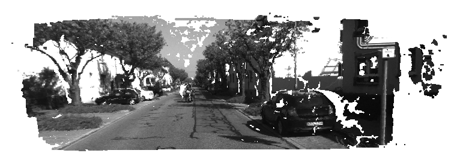

### RGB-D相机模型

RGB-D相机能通过物理方法获得像素深度信息。如果已知相机的内外参，我们就可以计算任何一个像素在世界坐标系下的位置从而建立一张点云地图。现在我们就来演示。

`color`文件夹给了5张RGB-D图片，`depth`给了5张深度图。

`pose.txt`给出五张图片的相机外参，以下式的形式存在。
$$
[ x, y, z, q_{x}, q_{y}, q_{z}, q_{w} ],
$$

```
-0.228993 0.00645704 0.0287837 -0.0004327 -0.113131 -0.0326832 0.993042
-0.50237 -0.0661803 0.322012 -0.00152174 -0.32441 -0.0783827 0.942662
-0.970912 -0.185889 0.872353 -0.00662576 -0.278681 -0.0736078 0.957536
-1.41952 -0.279885 1.43657 -0.00926933 -0.222761 -0.0567118 0.973178
-1.55819 -0.301094 1.6215 -0.02707 -0.250946 -0.0412848 0.966741
```

拼接后的图片

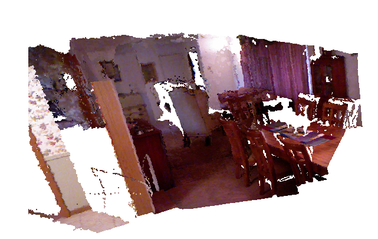

## 非线性优化

### 手写高斯牛顿法

#### 高斯牛顿法推导过程

书上的推导过程看不太懂，增量方程的形式写的有点奇怪，和后文的实践部分对应不上，参考[视频](https://www.bilibili.com/video/BV1zE41177WB/?spm_id_from=333.337.search-card.all.click&vd_source=8a137563261f849e155a1b19757d1449)。重点看雅可比矩阵和还森矩阵的形式，整体写的还是有点难理解，符号和书本，代码中不太对的上。

##### 雅可比矩阵

雅可比矩阵：是一阶导数的矩阵，

假设有一个`n*1`的向量，向量对应一个函数（每个函数里面的$x$为向量x），分别记为如下
$$
f : [ f_{1} ( x ), f_{2} ( x ), \cdots, f_{m} ( x ) ]
$$

$$
x : [ x_{1}, x_{2}, \cdots, x_{n} ]
$$

雅可比矩阵就记为如下，其中每一列是函数向量对于n维$x$向量的每一个分量求导数，而共有m个函数，因此雅可比矩阵共组成了一个`m*n`的矩阵。
$$
J=\left[ {\frac{\partial f} {\partial x_{1}}}, {\frac{\partial f} {\partial x_{2}}}, \cdots, {\frac{\partial f} {\partial x_{n}}} \right]=\left[ \begin{matrix} {{{\frac{\partial f_{1}} {\partial x_{1}}}}} & {{{\cdots}}} & {{{\frac{\partial f_{1}} {\partial x_{n}}}}} \\ {{{\vdots}}} & {{{\ddots}}} & {{{\vdots}}} \\ {{{\frac{\partial f_{m}} {\partial x_{n}}}}} & {{{\cdots}}} & {{{\frac{\partial f_{m}} {\partial x_{n}}}}} \\ \end{matrix} \right]
$$
 雅可比矩阵一般会用在泰勒展开公式中，其中一阶近似为：
$$
f ( x )=f ( x_{0} )+J ( x_{0} ) ( x-x_{0} )+o ( \| x-x_{0} \| )
$$
二阶近似中的Hassian矩阵是梯度的雅可比矩阵
$$
H ( f ( x ) )=J ( \nabla f ( x ) )
$$

##### 非线性拟合问题

已知一组数据点`(x,y)`，求函数曲线进行拟合。

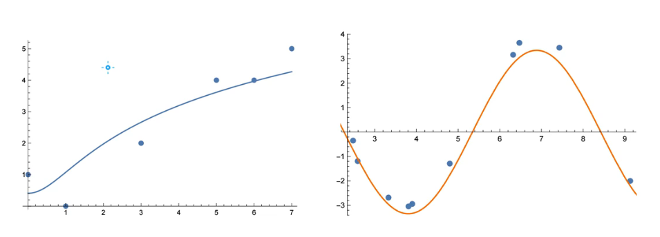

拟合问题和插值问题的区别和联系：总体上，拟合曲线不要求通过所有数据点，而插值要求通过所有数据点。

| 特性         | 拟合问题                                                     | 插值问题                                                     |
| ------------ | ------------------------------------------------------------ | ------------------------------------------------------------ |
| **定义**     | 通过一个函数去逼近一组数据点，使得该函数能够反映数据的整体趋势，但**不要求通过所有的已知数据点**。 | 通过一个函数完全**通过所有的已知数据点**，并用于推断这些点之间的未知值 |
| **适用场景** | 对噪声不敏感，适合处理带噪声数据；常用在数据建模、预测、分析带有噪声的实验数据 | 对噪声非常敏感，要求数据精准；用在精确重建数据之间的缺失值   |
| **典型方法** | 最小二乘法、机器学习模型等                                   | 拉格朗日插值、多项式插值、样条插值等                         |

##### 目标函数

优化问题：找到曲线函数，是的曲线对于所有数据点的误差最小。

首先有一个曲线函数，共m个观测点，每个点取决于p个向量，如下式所示
$$
f ( x_{1}, x_{2}, \cdots, x_{p} ; \beta_{1}, \beta_{2} \cdots, \beta_{n} )
$$
目标函数即使最小化n个点的误差，如下所示
$$
\operatorname* {m i n} S=\sum_{i=1}^{m} ( f ( x_{i} ; \boldsymbol{\beta} )-y_{i} )^{2}
$$
其中每个点的误差就是，共有m个误差的标量
$$
r_{i}=f ( x_{i} ; \boldsymbol{\beta} )-y_{i}
$$

$$
\boldsymbol{r}=[ r_{1} \quad\ldots\quad r_{m} ]^{\mathrm{T}}
$$

将目标函数使用$r$来表示，乘得的结果为目标函数标量（`1*m` * `m*1`）
$$
S=\sum_{i=1}^{m} r_{i}^{2}=\boldsymbol{r}^{\mathrm{T}} \boldsymbol{r}
$$
而目标函数对于$\beta$求导，使用复合函数求导$r^2$，其中$r=r(\beta)$，因此每一项求导的结果为
$$
\frac{\partial S} {\partial\beta_{j}}=2 \sum_{i=1}^{m} r_{i} \frac{\partial r_{i}} {\partial\beta_{j}}
$$
总共梯度的矩阵为
$$
\nabla S ( \boldsymbol{\beta} )=[ \frac{\partial S} {\partial\beta_{1}} \quad\cdots\quad\frac{\partial S} {\partial\beta_{n}} ]^{\mathrm{T}}
$$
可以用雅可比矩阵来表示梯度的矩阵
$$
\nabla S=2 J^{\mathrm{T}} \boldsymbol{r}
$$
继续求二阶偏导数Hassian，使用链式求导法则
$$
\frac{\partial^{2} S} {\partial\beta_{k} \partial\beta_{j}}=2 \frac{\partial} {\partial\beta_{k}} ( \sum_{i=1}^{m} r_{i} \frac{\partial r_{i}} {\partial\beta_{j}} )=2 \sum_{i=1}^{m} ( \frac{\partial r_{i}} {\partial\beta_{k}} \frac{\partial r_{i}} {\partial\beta_{j}}+r_{i} \frac{\partial^{2} r_{i}} {\partial\beta_{k} \partial\beta_{j}} ) 
$$
括号内部左侧为两个雅可比矩阵相乘，右侧定义一个新的矩阵元素$O$，最后可以表示出Hassian矩阵的形式，而一般在实际中会省略矩阵元素$O$。并且需要注意的是，Hassian前面的2有时候在一些教材的表示中会被省略，而之写成两个雅可比矩阵相乘。
$$
O_{k j}=\sum_{i=1}^{m} r_{i} \frac{\partial^{2} r_{i}} {\partial\beta_{k} \partial\beta_{j}}
$$

$$
H=2 ( J^{\mathrm{T}} J+\boldsymbol{O} )=2 ( J^{\mathrm{T}} J )  或 (J^{\mathrm{T}} J)
$$

其余的牛顿法，高斯牛顿法的推导过程，看回书本上的，或者用代码重点是理解雅可比矩阵和海森矩阵。只能慢慢感受，实在很难一下子理解。

#### 实践

- 目标：通过高斯牛顿法，优化非线性函数模型，使其能够尽可能贴近噪声的观测数据
- 输入：根据设置的真实参数`a_real, b_real, c_real`，和设置的`x`数据点，生成`y`数据点，并加入噪声`w`
- 输出：初始设置非线性函数的系数`a_estimate, b_estimate, c_estimate`，使用高斯牛顿优化系数，计算最终优化的结果和其中误差的变化。

$$
y=\operatorname{e x p} ( a x^{2}+b x+c )+w,
$$

根据a_real, b_real, c_real 生成真实数据x, y

```C++

vector<double> x_data, y_data;     
for (int i = 0; i < N; i++) {
double x = i / 100.0;  // x 从 0 到 1 分布，步长为 0.01。
x_data.push_back(x);  // x_data：存储生成的 x 值，
y_data.push_back(exp(a_real * x * x + b_real * x + c_real) + rng.gaussian(w_sigma * w_sigma));  // rng.gaussian(w_sigma * w_sigma) 使用高斯分布生成噪声，标准差为 w_sigma，其中 w_sigma 的平方作为方差传递给 gaussian 函数
}
```

高斯牛顿迭代过程：初始化海森矩阵，偏置，误差

```C++
for (int iter = 0; iter < iterations; iter++) {

    Matrix3d H = Matrix3d::Zero();             // Hessian = J^T W^{-1} J in Gauss-Newton
    Vector3d b = Vector3d::Zero();             // bias
    cost = 0;
```

计算误差，雅可比矩阵（偏导数）

```C++
for (int i = 0; i < N; i++) {
      double xi = x_data[i], yi = y_data[i];  // 第i个数据点
      double error = yi - exp(a_estimate * xi * xi + b_estimate * xi + c_estimate);  // 计算误差
      Vector3d J; // 雅可比矩阵，误差项对每个系数的偏导数
      J[0] = -xi * xi * exp(a_estimate * xi * xi + b_estimate * xi + c_estimate);  // de/da
      J[1] = -xi * exp(a_estimate * xi * xi + b_estimate * xi + c_estimate);  // de/db
      J[2] = -exp(a_estimate * xi * xi + b_estimate * xi + c_estimate);  // de/dc

      H += inv_sigma * inv_sigma * J * J.transpose();  // 累积海森矩阵
      b += -inv_sigma * inv_sigma * error * J;  // 累积偏置

      cost += error * error; // 误差平方和
    }
```

参数更新，更新的就是

```C++
// 更新参数 
a_estimate += dx[0];  
b_estimate += dx[1];
c_estimate += dx[2];
```

### Ceres曲线拟合

谷歌团队的C++优化库，链接地址如下：

- github：**[ceres-solver](https://github.com/ceres-solver/ceres-solver)**
- http://ceres-solver.org/

使用APT下载预编译版本

```bash
sudo apt install libceres-dev
```

定义残差块

```C++
// 代价函数的计算模型
struct CURVE_FITTING_COST {
  CURVE_FITTING_COST(double x, double y) : _x(x), _y(y) {}

  // 残差的计算
  template<typename T>
  bool operator()(
    const T *const abc, // 模型参数，有3维
    T *residual) const {
    residual[0] = T(_y) - ceres::exp(abc[0] * T(_x) * T(_x) + abc[1] * T(_x) + abc[2]); // y-exp(ax^2+bx+c)
    return true;
  }

  const double _x, _y;    // x,y数据
};
```

定义参数块，即待优化的参数`abc`

```C++
  // 生成参数值
  double a_real = 1.0, b_real = 2.0, c_real = 1.0;         // 真实参数值
  double a_estimate = 2.0, b_estimate = -1.0, c_estimate = 5.0;        // 估计参数值
  int N = 100;                                 // 数据点
  double w_sigma = 1.0;                        // 噪声Sigma值
  double inv_sigma = 1.0 / w_sigma;
  cv::RNG rng;                                 // OpenCV随机数产生器

  vector<double> x_data, y_data;      
  for (int i = 0; i < N; i++) {
    double x = i / 100.0;
    x_data.push_back(x);
    y_data.push_back(exp(a_real * x * x + b_real * x + c_real) + rng.gaussian(w_sigma * w_sigma));
  }

  double abc[3] = {a_estimate, b_estimate, c_estimate};
```

使用Ceres求解的特点是，使用一个`Problem`对象，把所有的参数块和残差块加入到这个对象中来求解，并使用自动求导`AutoDiffCostFunction`。

```C++
// 构建最小二乘问题，把所有的参数块和残差块加入到Ceres的定义中
  ceres::Problem problem;
  for (int i = 0; i < N; i++) {
    problem.AddResidualBlock(     // 向问题中添加误差项
      // 使用自动求导，模板参数：误差类型，输出维度，输入维度，维数要与前面struct中一致
      new ceres::AutoDiffCostFunction<CURVE_FITTING_COST, 1, 3>(
        new CURVE_FITTING_COST(x_data[i], y_data[i])
      ),
      nullptr,            // 核函数，这里不使用，为空
      abc                 // 待估计参数
    );
  }
```

使用Solver求解器进行求解

```C++
// 配置求解器Solver，调用函数Solvve
  ceres::Solver::Options options;     // 这里有很多配置项可以填
  options.linea_real_solver_type = ceres::DENSE_NORMAL_CHOLESKY;  // 增量方程如何求解
  options.minimizer_progress_to_stdout = true;   // 输出到cout

  ceres::Solver::Summa_realy summa_realy;                // 优化信息
  chrono::steady_clock::time_point t1 = chrono::steady_clock::now();
  ceres::Solve(options, &problem, &summa_realy);  // 开始优化
```

### g2o曲线拟合

#### 图优化

基于图优化的优化库g2o（General Graphic Optiminization）

- C++库地址：https://github.com/RainerKuemmerle/g2o
- Python库地址：https://github.com/miquelmassot/g2o-python

```bash
sudo apt install libg2o-dev
```

图优化是把优化问题表示成图的一种形式。一个图包含的基本要素如下：

- 顶点：优化变量
- 边：与顶点相连，表示误差项

而SLAM的相机位姿估计问题可以用下面的图来描述

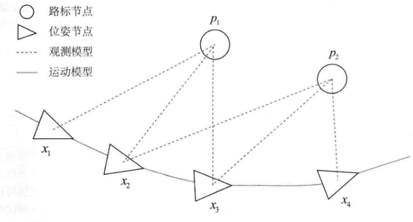

#### g2o拟合函数

拟合函数示意图表示如下，重点在于优化参数`a,b,c`形成一个顶点。

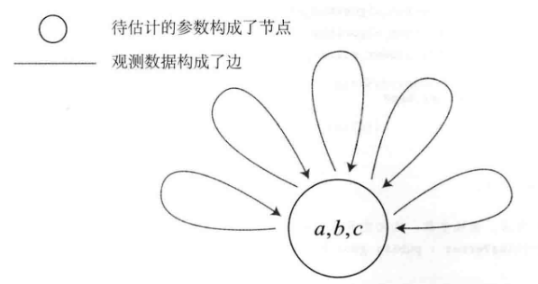

g2o库的使用流程：

- 定义顶点和边
- 构建图
- 选择优化算法
- 调用g2o进行优化，返回结果

#### g2o库使用问题

无法找到`g2o`库，我是参考[这篇文章](https://blog.51cto.com/u_6725876/8141267)解决的。

## 视觉里程计1

### 特征提取和匹配

#### OpenCV的ORB特征

视觉的大部分代码OpenCV都有实现，OpevCV有C++，Python版本，虽然在SLAM十四讲中都是C++代码，但是需要清楚Python的代码也会比较多，不要只局限在C++代码这里，但是对于一个SLAM系统，考虑实时、运行效率的问题，因此绝大部分SLAM的代码都是C++。

OpenCV之前已经配置过环境，使用的是预编译版本。

这部分代码为`slambook2/ch7/orb_cv.cpp`

实现结果：提取图片的特征点

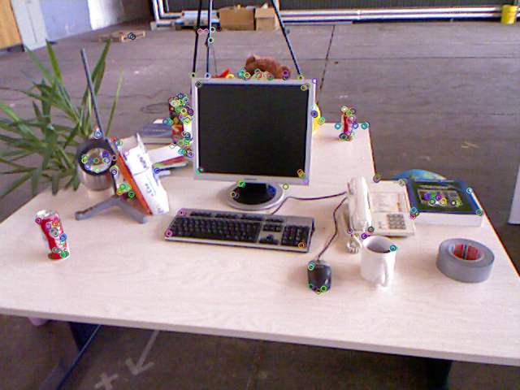

特征匹配：分别是经过筛选和未经过筛选的结果，**筛选标准是汉明距离小于最小距离的2倍**。

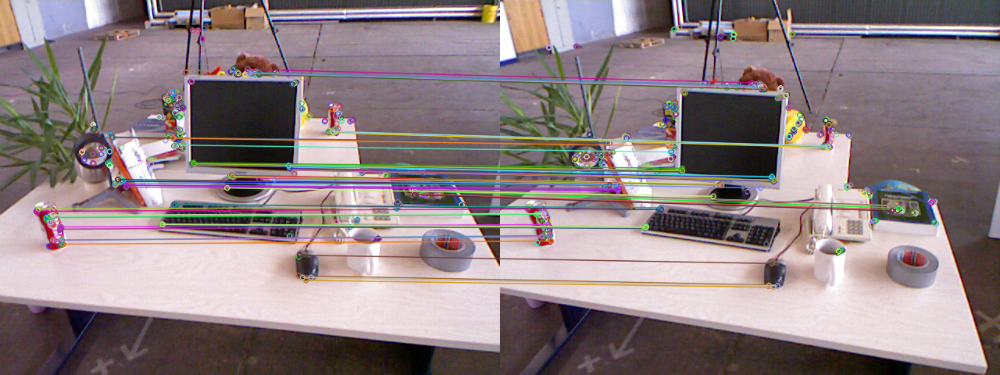


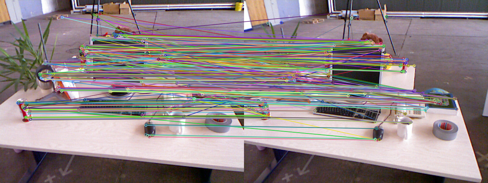

实现过程：初始化关键点和描述子

```C++
//-- 初始化变量: 存储关键点和描述子
// 使用 ORB::create() 创建 ORB 特征检测器和描述子提取器。
// 使用 DescriptorMatcher::create() 创建一个基于 Hamming 距离的暴力匹配器。
std::vector<KeyPoint> keypoints_1, keypoints_2;
Mat descriptors_1, descriptors_2;
Ptr<FeatureDetector> detector = ORB::create();  // ORB特征检测器
Ptr<DescriptorExtractor> descriptor = ORB::create();  // ORB描述子提取器
Ptr<DescriptorMatcher> matcher = DescriptorMatcher::create("BruteForce-Hamming");  //  基于 Hamming 距离的暴力匹配器
```

筛选：当描述子之间的距离大于两倍的最小距离时,即认为匹配有误.但有时候最小距离会非常小,设置一个经验值30作为下限.

```C++
//-- 第四步:匹配点对筛选
// 计算最小距离和最大距离
auto min_max = minmax_element(matches.begin(), matches.end(),
                            [](const DMatch &m1, const DMatch &m2) { return m1.distance < m2.distance; });
double min_dist = min_max.first->distance;
double max_dist = min_max.second->distance;

printf("-- Max dist : %f \n", max_dist);
printf("-- Min dist : %f \n", min_dist);

//当描述子之间的距离大于两倍的最小距离时,即认为匹配有误.但有时候最小距离会非常小,设置一个经验值30作为下限.
std::vector<DMatch> good_matches;
for (int i = 0; i < descriptors_1.rows; i++) {
    if (matches[i].distance <= max(2 * min_dist, 30.0)) {
      good_matches.push_back(matches[i]);
    }
}
```


#### 手写ORB特征

实现结果：与OpenCV的实现结果略有不同，选取出的特征点会更多。

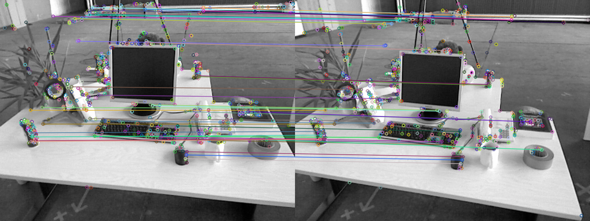

代码解读，仅针对每个函数的输入输出进行记录

计算ORB的特征

```C++
/**
 * compute descriptor of orb keypoints：ORB特征提取函数 
 * @param img input image：输入图像
 * @param keypoints detected fast keypoints：图像中的特征点
 * @param descriptors descriptors：ORB特征描述子
 *
 * NOTE: if a keypoint goes outside the image boundary (8 pixels), descriptors will not be computed and will be left as
 * empty
 */
void ComputeORB(const cv::Mat &img, vector<cv::KeyPoint> &keypoints, vector<DescType> &descriptors);
```

两副图像的描述子暴力匹配

```C++
/**
 * brute-force match two sets of descriptors：两副图像描述子使用暴力匹配
 * @param desc1 the first descriptor
 * @param desc2 the second descriptor
 * @param matches matches of two images
 */
void BfMatch(const vector<DescType> &desc1, const vector<DescType> &desc2, vector<cv::DMatch> &matches);
```

### 计算相机运动

根据已经匹配好的点对，来估计相机的运动，根据相机的原理不同，分为不同的方法：

1. 当相机为**单目**时，我们只知道 2D的像素坐标，因而问题是根据两组 2D 点估计运动。该问题用对极几何解决。
2. 当相机为**双目、RGB-D**时，或者通过某种方法得到了距离信息，那么问题就是根据两组
   3D点估计运动。该问题通常用ICP解决。
3. 如果**一组为3D，一组为 2D**，即我们得到了一些 3D 点和它们在相机的投影位置，也能估计相机的运动。该问题通过**PnP**求解。

#### 2D-2D对极几何

##### 对极几何求解相机运动

计算步骤为：

1. **加载图像**：从命令行输入两个图像路径，利用 OpenCV 的 `imread` 加载两幅图像。
2. **特征匹配**：调用 `find_feature_matches` 函数，在两幅图像中检测特征点并匹配。
3. **相机运动估计**：调用 `pose_estimation_2d2d`，通过匹配点估计相机的旋转矩阵 RRR 和平移向量 ttt。
4. 验证对极几何约束
   - 使用平移向量 t 构造反对称矩阵 t^。
   - 验证匹配点是否符合对极几何约束$y_{2}^{T} ( t^{R} ) y_{1} \approx0$

使用的代码是`slambook2/ch7/pose_estimation_2d2d.cpp`

使用ORB特征点法，匹配特征点，过程和前面的OpenCV的ORB特征法一致。

```C++
void find_feature_matches(const Mat &img_1, const Mat &img_2,
                          std::vector<KeyPoint> &keypoints_1,
                          std::vector<KeyPoint> &keypoints_2,
                          std::vector<DMatch> &matches)
```

通过特征点估计相机的运动 / 图像间的几何关系

```C++
void pose_estimation_2d2d(std::vector<KeyPoint> keypoints_1,
                          std::vector<KeyPoint> keypoints_2,
                          std::vector<DMatch> matches,
                          Mat &R, Mat &t) {
  // 相机内参,TUM Freiburg2
  Mat K = (Mat_<double>(3, 3) << 520.9, 0, 325.1, 0, 521.0, 249.7, 0, 0, 1);

  //-- 把匹配点从DMatch格式转换为vector<Point2f>的形式
  vector<Point2f> points1;
  vector<Point2f> points2;
  for (int i = 0; i < (int) matches.size(); i++) {
    points1.push_back(keypoints_1[matches[i].queryIdx].pt);
    points2.push_back(keypoints_2[matches[i].trainIdx].pt);
  }

  //-- 计算基础矩阵Fundamental Matrix
  Mat fundamental_matrix;
  fundamental_matrix = findFundamentalMat(points1, points2, cv::FM_8POINT);
  cout << "fundamental_matrix is " << endl << fundamental_matrix << endl;

  //-- 计算本质矩阵Essential Matrix
  Point2d principal_point(325.1, 249.7);  //相机光心, TUM dataset标定值
  double focal_length = 521;      //相机焦距, TUM dataset标定值
  Mat essential_matrix;
  essential_matrix = findEssentialMat(points1, points2, focal_length, principal_point);
  cout << "essential_matrix is " << endl << essential_matrix << endl;

  //-- 计算单应矩阵Homography Matrix
  //-- 但是本例中场景不是平面，单应矩阵意义不大
  Mat homography_matrix;
  homography_matrix = findHomography(points1, points2, RANSAC, 3);
  cout << "homography_matrix is " << endl << homography_matrix << endl;

  //-- 从本质矩阵中恢复旋转和平移信息.
  // 此函数仅在Opencv3中提供
  recoverPose(essential_matrix, points1, points2, R, t, focal_length, principal_point);
  cout << "R is " << endl << R << endl;
  cout << "t is " << endl << t << endl;
```

将像素坐标转换为相机的归一化坐标，用于进一步的三维坐标计算

```C++
Point2d pixel2cam(const Point2d &p, const Mat &K) {
  return Point2d
    (
      (p.x - K.at<double>(0, 2)) / K.at<double>(0, 0),
      (p.y - K.at<double>(1, 2)) / K.at<double>(1, 1)
    );
}
```

对极几何验证

```C++
  //-- 验证对极约束
  Mat K = (Mat_<double>(3, 3) << 520.9, 0, 325.1, 0, 521.0, 249.7, 0, 0, 1);
  for (DMatch m: matches) {
    Point2d pt1 = pixel2cam(keypoints_1[m.queryIdx].pt, K);
    Mat y1 = (Mat_<double>(3, 1) << pt1.x, pt1.y, 1);
    Point2d pt2 = pixel2cam(keypoints_2[m.trainIdx].pt, K);
    Mat y2 = (Mat_<double>(3, 1) << pt2.x, pt2.y, 1);
    Mat d = y2.t() * t_x * R * y1;  // 对极几何验证
    cout << "epipolar constraint = " << d << endl;
  }
```

##### 三角测量

在使用对极几何求解了相机运动后（$R, t$），进一步用相机的运动估计特征点的深度信息（$s_1, s_2$）。单目SLAM中无法获得特征点的深度信息，需要用三角测量模型进行计算。

计算步骤如下：

- **特征点提取与匹配**：**函数`find_feature_matches`**：通过ORB算法提取图像中的关键点和描述子，并利用Hamming距离进行匹配。最终筛选出可靠的匹配点。
- **两幅图像的相对姿态估计**：**函数`pose_estimation_2d2d`**：使用匹配点计算本质矩阵（Essential Matrix），并从中恢复旋转矩阵`R`和平移向量`t`。
- **三角化**：**函数`triangulation`**：利用旋转矩阵`R`和平移向量`t`，通过匹配点对，使用相机投影矩阵计算空间点的3D坐标。
- **结果可视化**：**通过`cv::circle`**在两幅图像中标出特征点，并根据深度信息改变颜色，验证三角化的结果。

特征点匹配和相机姿态估计和前面相同。

三角测量：使用OpenCV内置的方法即可。

```C++
cv::triangulatePoints(T1, T2, pts_1, pts_2, pts_4d);
```

结果可视化：

在图像 上绘制点，每个点的颜色通过 `get_color(depth1)` 函数计算得到，颜色由特征点对应的三维点的深度值 `points[i].z` 决定：

- 深度值较小（靠近相机）：颜色偏紫。
- 深度值较大（远离相机）：颜色偏红。

图1的颜色取值

```C++
float depth1 = points[i].z;
    cout << "depth: " << depth1 << endl;
    Point2d pt1_cam = pixel2cam(keypoints_1[matches[i].queryIdx].pt, K);
    cv::circle(img1_plot, keypoints_1[matches[i].queryIdx].pt, 2, get_color(depth1), 2);
```

#### 3D-2D：PnP

PnP（Perspective-n-Point）是求解3D到2D点对运动的方法，描述了当知道n个3D空间点及其投影位置时，如何估计相机的位姿。

PnP问题的求解方法有：

- 线性方法：
  - 直接线性变换（direct linear transform，DLT）
  - P3P：使用3对点估计位姿
  - EPnP（Efficint PnP），UPnP：在P3P基础上的优化方法
- 非线性优化：构建最小二乘方法进行迭代求解，光束平差法（Bundle Adjustment，BA）

在SLAM中的通常做法是：先使用P3P/EPnP方法估计相机位姿，再构建最小二乘优化问题对估计值进行调整（BA）

##### EPnP求解相机位姿

特征提取和匹配过程：和前面的ORB相同，初始化关键点、描述子等，

```C++
// 函数定义
void find_feature_matches(
  const Mat &img_1, const Mat &img_2,
  std::vector<KeyPoint> &keypoints_1,
  std::vector<KeyPoint> &keypoints_2,
  std::vector<DMatch> &matches);

// 函数调用
Mat img_1 = imread(argv[1], cv::IMREAD_COLOR);
Mat img_2 = imread(argv[2], cv::IMREAD_COLOR);
assert(img_1.data && img_2.data && "Can not load images!");
vector<KeyPoint> keypoints_1, keypoints_2;
vector<DMatch> matches;
find_feature_matches(img_1, img_2, keypoints_1, keypoints_2, matches);  // 匹配特征点
cout << "一共找到了" << matches.size() << "组匹配点" << endl;
```

生成3D点

```C++
Mat d1 = imread(argv[3], IMREAD_UNCHANGED);  // 读取深度图
Mat K = (Mat_<double>(3, 3) << 520.9, 0, 325.1, 0, 521.0, 249.7, 0, 0, 1);
vector<Point3f> pts_3d;
vector<Point2f> pts_2d;
for (DMatch m:matches) {
ushort d = d1.ptr<unsigned short>(int(keypoints_1[m.queryIdx].pt.y))[int(keypoints_1[m.queryIdx].pt.x)];
if (d == 0)   // bad depth
  continue;
float dd = d / 5000.0;
Point2d p1 = pixel2cam(keypoints_1[m.queryIdx].pt, K);  // 像素坐标转相机归一化坐标
pts_3d.push_back(Point3f(p1.x * dd, p1.y * dd, dd));  // 结合深度图的深度，生成三维坐标
pts_2d.push_back(keypoints_2[m.trainIdx].pt);
}
```

使用OpenCV求解EPnP问题

```C++
chrono::steady_clock::time_point t1 = chrono::steady_clock::now();
Mat r, t;
solvePnP(pts_3d, pts_2d, K, Mat(), r, t, false); // 调用OpenCV 的 PnP 求解，可选择EPNP，DLS等方法
Mat R;
cv::Rodrigues(r, R); // r为旋转向量形式，用Rodrigues公式转换为矩阵
chrono::steady_clock::time_point t2 = chrono::steady_clock::now();
chrono::duration<double> time_used = chrono::duration_cast<chrono::duration<double>>(t2 - t1);
cout << "solve pnp in opencv cost time: " << time_used.count() << " seconds." << endl;
cout << "R=" << endl << R << endl;
cout << "t=" << endl << t << endl;
```

##### 手写位姿估计-高斯牛顿迭代优化

和之前的高斯牛顿迭代法思路相似。

##### g2o优化

g2o的BA优化示意图解释：

- 节点：第二个相机的位姿
- 边：每个3D点在第二个相机中的投影

第一个相机的位姿估计为0，因此PnP问题相当于求解相机的相对运动，也即第二个相机的位姿。

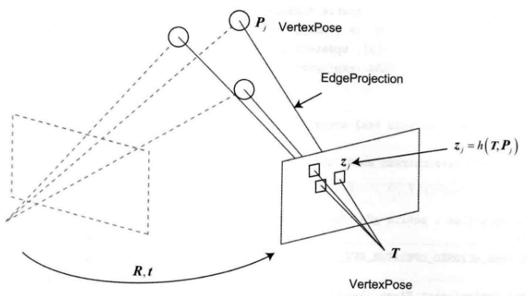

函数输入：

- **`points_3d`**：三维空间中的点集。
- **`points_2d`**：对应图像平面上的二维点集。
- **`K`**：相机的内参矩阵。
- **`pose`**：初始的相机位姿（SE(3)变换），通过优化更新后返回。

```C++
void bundleAdjustmentG2O(
  const VecVector3d &points_3d,
  const VecVector2d &points_2d,
  const Mat &K,
  Sophus::SE3d &pose)
```

g2o的优化图的初始化

```C++
// 构建图优化，先设定g2o
typedef g2o::BlockSolver<g2o::BlockSolverTraits<6, 3>> BlockSolverType;  // 位姿的优化维度是6,路标的优化维度是3
typedef g2o::LinearSolverDense<BlockSolverType::PoseMatrixType> LinearSolverType; // 线性求解器类型：采用稠密矩阵的线性求解器
// 梯度下降方法，可以从GN, LM, DogLeg 中选，此处选择了g2o的高斯牛顿
auto solver = new g2o::OptimizationAlgorithmGaussNewton(std::make_unique<BlockSolverType>(std::make_unique<LinearSolverType>())); 
g2o::SparseOptimizer optimizer;     // 图模型
optimizer.setAlgorithm(solver);   // 设置求解器
optimizer.setVerbose(true);       // 打开调试输出
```

添加相机位姿顶点

```C++
// 添加相机位姿顶点
VertexPose *vertex_pose = new VertexPose(); // 自定义的g2o顶点类型，表示相机的位姿(SE(3))
vertex_pose->setId(0);  // 设置顶点ID，必须唯一，一般从0开始
vertex_pose->setEstimate(Sophus::SE3d()); // 设置顶点初始估计值的单位转换
optimizer.addVertex(vertex_pose);
```

提取相机内参：将 OpenCV 格式的 cv::Mat 相机内参矩阵 K 转换为 Eigen 格式，方便在 g2o 优化中使用。

```C++
Eigen::Matrix3d K_eigen;
K_eigen <<
      K.at<double>(0, 0), K.at<double>(0, 1), K.at<double>(0, 2),
K.at<double>(1, 0), K.at<double>(1, 1), K.at<double>(1, 2),
K.at<double>(2, 0), K.at<double>(2, 1), K.at<double>(2, 2);
```

添加g2o优化图的边

```C++
int index = 1;
for (size_t i = 0; i < points_2d.size(); ++i) {
    auto p2d = points_2d[i];
    auto p3d = points_3d[i];
    EdgeProjection *edge = new EdgeProjection(p3d, K_eigen);
    edge->setId(index);
    edge->setVertex(0, vertex_pose);
    edge->setMeasurement(p2d);
    edge->setInformation(Eigen::Matrix2d::Identity());
    optimizer.addEdge(edge);
    index++;
}
```

优化器开始优化

```C++
chrono::steady_clock::time_point t1 = chrono::steady_clock::now();
optimizer.setVerbose(true);
optimizer.initializeOptimization();
optimizer.optimize(10);
chrono::steady_clock::time_point t2 = chrono::steady_clock::now();
chrono::duration<double> time_used = chrono::duration_cast<chrono::duration<double>>(t2 - t1);
cout << "optimization costs time: " << time_used.count() << " seconds." << endl;
cout << "pose estimated by g2o =\n" << vertex_pose->estimate().matrix() << endl;
pose = vertex_pose->estimate();
```

其中还使用了类`EdgeProjection`，这个类是继承自 `g2o::BaseUnaryEdge`，用于构建图优化中的单边（Unary Edge）。它将一个 3D 空间点投影到图像平面，并计算投影误差。

```C++
class EdgeProjection : public g2o::BaseUnaryEdge<2, Eigen::Vector2d, VertexPose> {
public:
  EIGEN_MAKE_ALIGNED_OPERATOR_NEW;

  EdgeProjection(const Eigen::Vector3d &pos, const Eigen::Matrix3d &K) : _pos3d(pos), _K(K) {}

  // 计算投影误差
  virtual void computeError() override {
    const VertexPose *v = static_cast<VertexPose *> (_vertices[0]);  // 获取当前边关联的顶点
    Sophus::SE3d T = v->estimate();  // 使用Sophus的SE3d进行变换
    Eigen::Vector3d pos_pixel = _K * (T * _pos3d);  // 将世界坐标投影到像素坐标
    pos_pixel /= pos_pixel[2];  // 归一化深度坐标z，得到像素坐标 
    _error = _measurement - pos_pixel.head<2>();  // 计算误差
  }

  // 计算雅可比矩阵，用于优化中的梯度计算。
  virtual void linearizeOplus() override {
    const VertexPose *v = static_cast<VertexPose *> (_vertices[0]);
    Sophus::SE3d T = v->estimate();
    Eigen::Vector3d pos_cam = T * _pos3d;
    double fx = _K(0, 0);
    double fy = _K(1, 1);
    double cx = _K(0, 2);
    double cy = _K(1, 2);
    double X = pos_cam[0];
    double Y = pos_cam[1];
    double Z = pos_cam[2];
    double Z2 = Z * Z;
    _jacobianOplusXi
      << -fx / Z, 0, fx * X / Z2, fx * X * Y / Z2, -fx - fx * X * X / Z2, fx * Y / Z,
      0, -fy / Z, fy * Y / (Z * Z), fy + fy * Y * Y / Z2, -fy * X * Y / Z2, -fy * X / Z;
  }

  virtual bool read(istream &in) override {return true;}
  virtual bool write(ostream &out) const override {return true;}

// 数据成员
private:
  Eigen::Vector3d _pos3d;  // _pos3d：存储与该边关联的 3D 点位置。
  Eigen::Matrix3d _K;  // _K：相机内参矩阵（用于将 3D 点投影到图像平面）。
};
```

#### 3D-3D：ICP

##### SVD方法

按照注释来看即可。

```C++
// 3d-3d
void pose_estimation_3d3d(const vector<Point3f> &pts1,
                          const vector<Point3f> &pts2,
                          Mat &R, Mat &t) {
  // 计算点云的质心
  Point3f p1, p2;  
  int N = pts1.size();
  for (int i = 0; i < N; i++) {
    p1 += pts1[i];
    p2 += pts2[i];
  }
  p1 = Point3f(Vec3f(p1) / N);
  p2 = Point3f(Vec3f(p2) / N);
  // 计算每个点的去质心坐标
  vector<Point3f> q1(N), q2(N); 
  for (int i = 0; i < N; i++) {
    q1[i] = pts1[i] - p1;
    q2[i] = pts2[i] - p2;
  }

  // 计算旋转矩阵
  // 计算矩阵W = ∑(q1*q2^T)
  Eigen::Matrix3d W = Eigen::Matrix3d::Zero();
  for (int i = 0; i < N; i++) {
    W += Eigen::Vector3d(q1[i].x, q1[i].y, q1[i].z) * Eigen::Vector3d(q2[i].x, q2[i].y, q2[i].z).transpose();
  }
  cout << "W=" << W << endl;

  // SVD on W
  Eigen::JacobiSVD<Eigen::Matrix3d> svd(W, Eigen::ComputeFullU | Eigen::ComputeFullV);
  Eigen::Matrix3d U = svd.matrixU();
  Eigen::Matrix3d V = svd.matrixV();
  cout << "U=" << U << endl;
  cout << "V=" << V << endl;

  // R = U * V.T
  Eigen::Matrix3d R_ = U * (V.transpose());
  // 如果R的行列式为负，则取-R为最优值
  if (R_.determinant() < 0) {
    R_ = -R_;
  }
  Eigen::Vector3d t_ = Eigen::Vector3d(p1.x, p1.y, p1.z) - R_ * Eigen::Vector3d(p2.x, p2.y, p2.z);

  // convert to cv::Mat
  R = (Mat_<double>(3, 3) <<
    R_(0, 0), R_(0, 1), R_(0, 2),
    R_(1, 0), R_(1, 1), R_(1, 2),
    R_(2, 0), R_(2, 1), R_(2, 2)
  );
  t = (Mat_<double>(3, 1) << t_(0, 0), t_(1, 0), t_(2, 0));
}
```

##### 非线性优化方法

使用`g2o`进行非线性优化的写法和前面基本相同，都是写亿元边，然后优化相机位姿，不过这次没有相机模型。

#### 总结

从对极几何、PnP到ICP，我们使用到了越来越多的信息（没有深度、有一个图的深度、有两个图的深度），在深度准确的情况下，得到的估计也越来越准确。

但是对于需要使用深度点的方法，Kinect的深度图存在噪声、数据丢失的情况，会导致ICP的估计不够准确，并且由于特征点丢太多可能导致无法估计。

## 视觉里程计2

### LK光流

#### 推导过程

**Lucas-Kanade（LK）光流算法**是基于局部特性的方法，用于估计图像序列中像素的运动。它的推导基于光流约束方程和局部平滑假设。以下是推导过程的详细解析：

#### OpenCV实现

先检测出关键点，用于后续的光流计算中

```C++
// images, note they are CV_8UC1, not CV_8UC3
Mat img1 = imread(file_1, 0);
Mat img2 = imread(file_2, 0);

// 检测关键点，将选出的关键点用在后续的光流计算中：key points, using GFTT here.
vector<KeyPoint> kp1;
Ptr<GFTTDetector> detector = GFTTDetector::create(500, 0.01, 20); // maximum 500 keypoints
detector->detect(img1, kp1);
```

OpenCV实现只需要调用C++的函数即可

```C++
// use opencv's flow for validation
vector<Point2f> pt1, pt2;
for (auto &kp: kp1) pt1.push_back(kp.pt);
vector<uchar> status;
vector<float> error;
t1 = chrono::steady_clock::now();
cv::calcOpticalFlowPyrLK(img1, img2, pt1, pt2, status, error);
t2 = chrono::steady_clock::now();
time_used = chrono::duration_cast<chrono::duration<double>>(t2 - t1);
cout << "optical flow by opencv: " << time_used.count() << endl;
```

#### 高斯牛顿法实现光流

先编写了一个类，实现光流追踪器

```C++
class OpticalFlowTracker {
public:
    // 构造函数
    OpticalFlowTracker(
        const Mat &img1_,  // 第一张图片
        const Mat &img2_,  // // 第二张图片
        const vector<KeyPoint> &kp1_,  // 关键点
        vector<KeyPoint> &kp2_,  // 可修改
        vector<bool> &success_,
        bool inverse_ = true, bool has_initial_ = false) :
        img1(img1_), img2(img2_), kp1(kp1_), kp2(kp2_), success(success_), inverse(inverse_),
        has_initial(has_initial_) {} // 表示kp2是否已经有初始值，如果是True，算法会利用初始值进行优化

    void calculateOpticalFlow(const Range &range);

// 私有成员变量
private:
    const Mat &img1;
    const Mat &img2;
    const vector<KeyPoint> &kp1;
    vector<KeyPoint> &kp2;
    vector<bool> &success;  // 存储光流点是否成功
    bool inverse = true;
    bool has_initial = false;  // 是否初始化kp2的值
};
```

##### 单层光流

基于上面的类，创建了一个单层光流的方法

```C++
// 函数声明
/**
 * single level optical flow
 * @param [in] img1 the first image
 * @param [in] img2 the second image
 * @param [in] kp1 keypoints in img1
 * @param [in|out] kp2 keypoints in img2, if empty, use initial guess in kp1
 * @param [out] success true if a keypoint is tracked successfully
 * @param [in] inverse use inverse formulation?
*/

// 函数定义
void OpticalFlowSingleLevel(
    const Mat &img1,
    const Mat &img2,
    const vector<KeyPoint> &kp1,
    vector<KeyPoint> &kp2,
    vector<bool> &success,
    bool inverse, bool has_initial) {
    kp2.resize(kp1.size());
    success.resize(kp1.size());
    OpticalFlowTracker tracker(img1, img2, kp1, kp2, success, inverse, has_initial);  // 创建光流跟踪器使用构造函数，初始化一个 OpticalFlowTracker 对象，该对象封装了图像、关键点和计算参数。
    // 使用parallel_for_ 并行计算；std::bind 将 OpticalFlowTracker::calculateOpticalFlow 方法绑定到 tracker 对象
    parallel_for_(Range(0, kp1.size()), std::bind(&OpticalFlowTracker::calculateOpticalFlow, &tracker, placeholders::_1));
}
```

把具体的单层光流方法，声明到了类中，另外封装为了一个函数

```C++
void OpticalFlowTracker::calculateOpticalFlow(const Range &range)
```

具体的单层光流计算过程

```C++
void OpticalFlowTracker::calculateOpticalFlow(const Range &range) {
    // parameters
    int half_patch_size = 4;
    int iterations = 10;

    // 并行计算处理
    for (size_t i = range.start; i < range.end; i++) {
        auto kp = kp1[i];
        double dx = 0, dy = 0; // dx,dy need to be estimated
        // 初始化位移，如果 has_initial 为真，则从 kp2 的初始值计算位移，否则dx=dy=0
        if (has_initial) {
            dx = kp2[i].pt.x - kp.pt.x;
            dy = kp2[i].pt.y - kp.pt.y;
        }

        double cost = 0, lastCost = 0;
        bool succ = true; // indicate if this point succeeded

        // Gauss-Newton iterations
        Eigen::Matrix2d H = Eigen::Matrix2d::Zero();    // hessian
        Eigen::Vector2d b = Eigen::Vector2d::Zero();    // bias
        Eigen::Vector2d J;  // jacobian
        for (int iter = 0; iter < iterations; iter++) {
            if (inverse == false) {
                H = Eigen::Matrix2d::Zero();
                b = Eigen::Vector2d::Zero();
            } else {
                // only reset b
                b = Eigen::Vector2d::Zero();
            }

            cost = 0;

            // 对每个关键点的局部窗口（half_patch_size）计算误差
            for (int x = -half_patch_size; x < half_patch_size; x++)
                for (int y = -half_patch_size; y < half_patch_size; y++) {
                    double error = GetPixelValue(img1, kp.pt.x + x, kp.pt.y + y) -
                                   GetPixelValue(img2, kp.pt.x + x + dx, kp.pt.y + y + dy);;  // Jacobian
                    if (inverse == false) {
                        J = -1.0 * Eigen::Vector2d(
                            0.5 * (GetPixelValue(img2, kp.pt.x + dx + x + 1, kp.pt.y + dy + y) -
                                   GetPixelValue(img2, kp.pt.x + dx + x - 1, kp.pt.y + dy + y)),
                            0.5 * (GetPixelValue(img2, kp.pt.x + dx + x, kp.pt.y + dy + y + 1) -
                                   GetPixelValue(img2, kp.pt.x + dx + x, kp.pt.y + dy + y - 1))
                        );
                    } else if (iter == 0) {
                        // in inverse mode, J keeps same for all iterations
                        // NOTE this J does not change when dx, dy is updated, so we can store it and only compute error
                        J = -1.0 * Eigen::Vector2d(
                            0.5 * (GetPixelValue(img1, kp.pt.x + x + 1, kp.pt.y + y) -
                                   GetPixelValue(img1, kp.pt.x + x - 1, kp.pt.y + y)),
                            0.5 * (GetPixelValue(img1, kp.pt.x + x, kp.pt.y + y + 1) -
                                   GetPixelValue(img1, kp.pt.x + x, kp.pt.y + y - 1))
                        );
                    }
                    // 优化变量计算，将误差平方和累积到cost，并计算海森矩阵H和偏置向量b
                    b += -error * J;  //偏置向量
                    cost += error * error;
                    if (inverse == false || iter == 0) {
                        H += J * J.transpose();  // 海森矩阵
                    }
                }

            // 解线性方程组H·update=b
            Eigen::Vector2d update = H.ldlt().solve(b);

            // 如果更新量中包含非法值nan，就认为优化失败，退出优化
            if (std::isnan(update[0])) {
                // sometimes occurred when we have a black or white patch and H is irreversible
                cout << "update is nan" << endl;
                succ = false;
                break;
            }

            if (iter > 0 && cost > lastCost) {
                break;
            }

            // update dx, dy
            dx += update[0];
            dy += update[1];
            lastCost = cost;
            succ = true;

            // 判断优化结果是否收敛
            if (update.norm() < 1e-2) {
                // converge
                break;
            }
        }

        success[i] = succ;

        // set kp2
        kp2[i].pt = kp.pt + Point2f(dx, dy);
    }
}
```

使用双线性插值来获取非整数坐标点的像素值

```C++
inline float GetPixelValue(const cv::Mat &img, float x, float y) {
    // boundary check
    if (x < 0) x = 0;
    if (y < 0) y = 0;
    if (x >= img.cols - 1) x = img.cols - 2;
    if (y >= img.rows - 1) y = img.rows - 2;
    
    float xx = x - floor(x);
    float yy = y - floor(y);
    int x_a1 = std::min(img.cols - 1, int(x) + 1);
    int y_a1 = std::min(img.rows - 1, int(y) + 1);
    
    return (1 - xx) * (1 - yy) * img.at<uchar>(y, x)
    + xx * (1 - yy) * img.at<uchar>(y, x_a1)
    + (1 - xx) * yy * img.at<uchar>(y_a1, x)
    + xx * yy * img.at<uchar>(y_a1, x_a1);
}
```

##### 多层光流

方法核心：

- 构建图像金字塔：4层，缩放尺度0.5，从粗至精进行计算
- 每层金字塔的计算过程调用单层金字塔的函数

构建图像金字塔

```C++
// pyramids: 金字塔层数，设为4层。pyramid_scale: 每层金字塔的缩放比例，0.5 表示尺寸缩小到上一层的50%。scales: 每层金字塔相对于原始图像的缩放比例。
    int pyramids = 4;
    double pyramid_scale = 0.5;
    double scales[] = {1.0, 0.5, 0.25, 0.125};

    // create pyramids
    chrono::steady_clock::time_point t1 = chrono::steady_clock::now();
    vector<Mat> pyr1, pyr2; // image pyramids
    for (int i = 0; i < pyramids; i++) {
        // 第0层是原图
        if (i == 0) {
            pyr1.push_back(img1);
            pyr2.push_back(img2);
        } else {
            Mat img1_pyr, img2_pyr;
            // 缩放图像构建金字塔
            cv::resize(pyr1[i - 1], img1_pyr,
                       cv::Size(pyr1[i - 1].cols * pyramid_scale, pyr1[i - 1].rows * pyramid_scale));
            cv::resize(pyr2[i - 1], img2_pyr,
                       cv::Size(pyr2[i - 1].cols * pyramid_scale, pyr2[i - 1].rows * pyramid_scale));
            pyr1.push_back(img1_pyr);
            pyr2.push_back(img2_pyr);
        }
    }
```

初始化关键点

```C++
// coarse-to-fine LK tracking in pyramids：初始化关键点金字塔
    vector<KeyPoint> kp1_pyr, kp2_pyr;
    for (auto &kp:kp1) {
        auto kp_top = kp;
        kp_top.pt *= scales[pyramids - 1];  // 将输入关键点 kp1 映射到金字塔的最顶层（分辨率最低的层）
        kp1_pyr.push_back(kp_top);  // kp1_pyr: 保存映射到每层金字塔的关键点位置
        kp2_pyr.push_back(kp_top);  // kp2_pyr: 保存输出关键点（光流计算结果）
    }
```

循环调用单层金字塔方法

```C++
// 从粗到精估计，从最上层开始估计，循环调用单层光流金字塔的方法
for (int level = pyramids - 1; level >= 0; level--) {
    // from coarse to fine
    success.clear();
    t1 = chrono::steady_clock::now();
    OpticalFlowSingleLevel(pyr1[level], pyr2[level], kp1_pyr, kp2_pyr, success, inverse, true);  // 对于每一层金字塔调用单层金字塔的计算过程
    t2 = chrono::steady_clock::now();
    auto time_used = chrono::duration_cast<chrono::duration<double>>(t2 - t1);
    cout << "track pyr " << level << " cost time: " << time_used.count() << endl;

    if (level > 0) {
        for (auto &kp: kp1_pyr)
            kp.pt /= pyramid_scale;
        for (auto &kp: kp2_pyr)
            kp.pt /= pyramid_scale;
    }
}
```

#### 实现结果

OpenCV光流

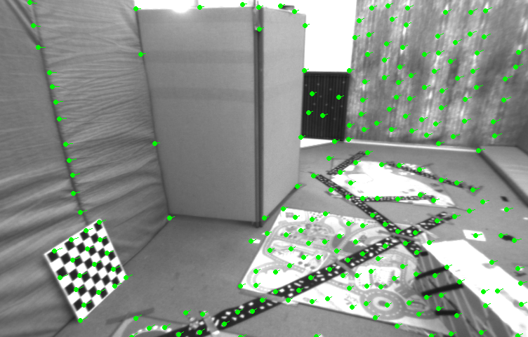

单层光流，在左侧的墙和地上的标定版位置的光流都比较杂乱。


多层光流

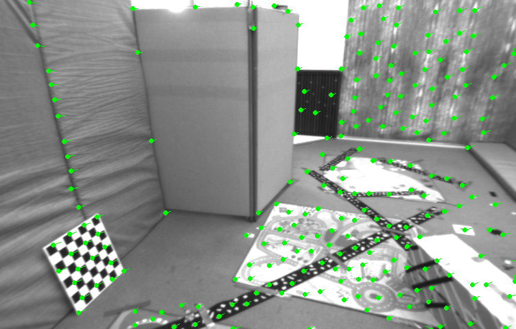

### 直接法

书中演示的是**稀疏**的方法，不使用GPU编程。直接使用带有深度的数据，即已知空间点的位置。主要演示多层直接法的追踪结果。程序运行是分成多层金字塔图像来显示。下图是原图的直接法追踪的结果。

`1.png`使用单层金字塔的追踪结果

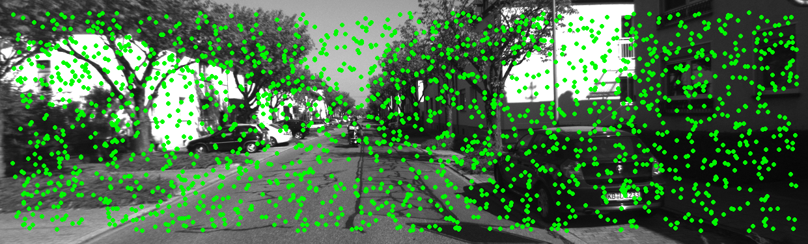

`1.png`使用多层金字塔的追踪结果

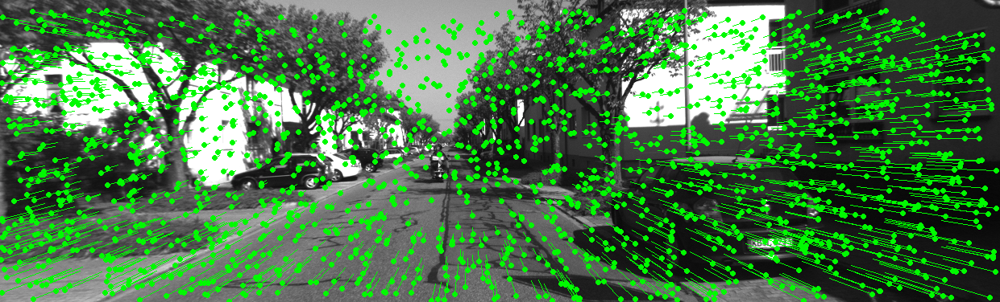

可以看出多层金字塔的追踪结果，对于大位移的结果会比较准确。单层金字塔基本上都是一个点。


雅可比并行计算类`JacobianAccumulator`

私有成员变量

```C++
private:
    const cv::Mat &img1;  // 参考图像
    const cv::Mat &img2;  // 当前图像
    const VecVector2d &px_ref;  // 参考图像中像素点的集合
    const vector<double> depth_ref;  // 深度点的集合
    Sophus::SE3d &T21;
    VecVector2d projection; // 投影点

    std::mutex hessian_mutex;  // 多线程计算时共享变量
    Matrix6d H = Matrix6d::Zero();
    Vector6d b = Vector6d::Zero();
    double cost = 0;
```

单层金字塔计算过程：调用`JacobianAccumulator`实例化对象进行计算

```C++
// 初始化
    const int iterations = 10;  // 最大迭代次数
    double cost = 0, lastCost = 0;  // 当前和上一轮的代价函数值
    auto t1 = chrono::steady_clock::now();
    JacobianAccumulator jaco_accu(img1, img2, px_ref, depth_ref, T21);  // 实例化雅可比累加器

    // 循环迭代过程
    for (int iter = 0; iter < iterations; iter++) {
        jaco_accu.reset();  // 每次循环的时候先重设H，b
        cv::parallel_for_(cv::Range(0, px_ref.size()), std::bind(&JacobianAccumulator::accumulate_jacobian, &jaco_accu, std::placeholders::_1));  // 并行计算雅可比矩阵
```

多层金字塔循环调用单层金字塔

```C++
for (int level = pyramids - 1; level >= 0; level--) {
        VecVector2d px_ref_pyr; // set the keypoints in this pyramid level
        for (auto &px: px_ref) {
            px_ref_pyr.push_back(scales[level] * px);
        }

        // scale fx, fy, cx, cy in different pyramid levels：在求解雅可比的使用带上了相机内参，在此处对于不同层的金字塔图像求解时也需要带上
        fx = fxG * scales[level];
        fy = fyG * scales[level];
        cx = cxG * scales[level];
        cy = cyG * scales[level];
        DirectPoseEstimationSingleLayer(pyr1[level], pyr2[level], px_ref_pyr, depth_ref, T21);  // 每一层循环调用单层金字塔
    }
```

## 后端1

### BAL数据集

全称为Bundle Adjustment in the Large，由 Google 提供，用于评估三维重建和优化算法，特别是 **Bundle Adjustment**（捆绑调整）问题。Bundle Adjustment 是计算机视觉领域的一个核心问题，涉及从多视角图像恢复三维场景结构和相机参数。

**目标**：通过优化三维点的坐标和相机的参数，最小化投影误差

数据集官网：https://grail.cs.washington.edu/projects/bal/，比较有年代感了

#### 数据集格式

- 数据集以文本文件的形式存储，主要包含以下信息：
  - **相机参数**：包括内参和外参。
  - **三维点坐标**。
  - **图像观测**：即图像中二维像素的投影位置。
- 文件通常以 `.txt` 或其他简单格式提供。

- **规模**：数据集中包含从小型场景（几百个点和少量相机）到大型场景（几百万点和上千台相机）的数据。

数据集格式，使用[bzip2](http://www.bzip.org/)，按照下面的格式进行存储

```txt
<num_cameras> <num_points> <num_observations>
<camera_index_1> <point_index_1> <x_1> <y_1>
...
<camera_index_num_observations> <point_index_num_observations> <x_num_observations> <y_num_observations>
<camera_1>
...
<camera_num_cameras>
<point_1>
...
<point_num_points>
```

文件头：第一行

```mathematica
<Number of Cameras> <Number of Points> <Number of Observations>
16 22106 83718
```

- **Number of Cameras**：相机的数量（16个相机）。
- **Number of Points**：三维点的数量（22106个三维点）。
- **Number of Observations**：二维图像观测的数量（83718个观测数量）。

观测数据：每行表示一次观测

```mathematica
<Camera Index> <Point Index> <x> <y>
```

- **Camera Index**：对应的相机编号（从 0 开始）。
- **Point Index**：对应的三维点编号（从 0 开始）。
- **x, y**：该三维点在图像中的像素坐标。

相机参数：每个相机有一组参数，总共为9个

```mathematica
<Camera Parameters>
```

- **旋转参数**（如旋转向量）。
- **平移向量**。
- **内参**（如焦距、径向畸变系数）。

三维点坐标：每个三维点的真实坐标 X,Y,Z

```mathematica
<Point Coordinates>
```

相机参数和三维点参数：在`txt`文件中是以一行存储一个数来放的，参数起始在第83720行，结束在150181行，**故共有66462行**，16个相机**共有参数9\*16=144个**，22106个3D点**共有参数22106\*3=66318个**。

### Ceres BA

找到网上给一个和类似的实现BA问题的代码仓库，非常冷门：https://github.com/Kindn/GraphOpt

#### bundle_adjustment.cpp

导入头文件：包括自己写的两个头文件`common.h`和`SnavelyReprojectionError.h`

```c++
#include <iostream>
#include <ceres/ceres.h>
#include "common.h"
#include "SnavelyReprojectionError.h"
```

主程序部分：重点是使用了`BALProblem`类，求解的方法为`SolveBA`（自己封装）

```C++
int main(int argc, char **argv) {
    if (argc != 2) {
        cout << "usage: bundle_adjustment_ceres bal_data.txt" << endl;
        return 1;
    }

    BALProblem bal_problem(argv[1]);  // 创建一个 BALProblem 对象，用来读取和管理捆绑调整问题的数据，包括相机参数、3D点和观测数据。
    bal_problem.Normalize();  // 对输入数据进行归一化
    bal_problem.Perturb(0.1, 0.5, 0.5);  // 对相机参数、3D点和观测数据施加小扰动，用于模拟更真实的初始条件
    bal_problem.WriteToPLYFile("initial.ply");  // 保存初始点云
    SolveBA(bal_problem);  // 求解BA问题
    bal_problem.WriteToPLYFile("final.ply");  // 保存优化后的点云

    return 0;
}
```

`SolveBA`：

- 接受传入的`BALProblem`类的实例对象
- 调用`Ceres`库创建鲁棒核函数，损失函数
- `SnavelyReprojectionError`：创建二维的残差块计算

```C++
void SolveBA(BALProblem &bal_problem) {
    const int point_block_size = bal_problem.point_block_size();  
    const int camera_block_size = bal_problem.camera_block_size(); 
    double *points = bal_problem.mutable_points();  // 三维点坐标
    double *cameras = bal_problem.mutable_cameras();  // 相机坐标
    const double *observations = bal_problem.observations();  // 观测数据，[x,y]二维坐标
    ceres::Problem problem;  // 创建一个 ceres::Problem 对象，用于管理优化变量和残差

    for (int i = 0; i < bal_problem.num_observations(); ++i) {  // 遍历所有观测点
        ceres::CostFunction *cost_function;

        // 残差块计算：输入是一个二维的相机矩阵，输出是一个二维的残差
        cost_function = SnavelyReprojectionError::Create(observations[2 * i + 0], observations[2 * i + 1]);

        // 添加鲁棒核函数： 使用 HuberLoss 函数降低误差点的影响
        ceres::LossFunction *loss_function = new ceres::HuberLoss(1.0);  

        // 找到每个观测点对应的相机和三维点
        double *camera = cameras + camera_block_size * bal_problem.camera_index()[i];
        double *point = points + point_block_size * bal_problem.point_index()[i];

        // 将残差块添加到优化问题
        problem.AddResidualBlock(cost_function, loss_function, camera, point);
    }

    ...

    // 设置优化选项
    ceres::Solver::Options options;
    options.linear_solver_type = ceres::LinearSolverType::SPARSE_SCHUR;  // 使用ceres，线性求解方法LinearSolverType，稀疏矩阵的Schur消元进行求解
    options.minimizer_progress_to_stdout = true;  // 打印优化过程中的信息
    ceres::Solver::Summary summary;  // summary存储优化的详细结果，包括初始残差、最终残差、迭代次数、求解时间等
    ceres::Solve(options, &problem, &summary);  // 求解问题并保存求解器的结果
    std::cout << summary.FullReport() << "\n";  // 打印求解器的详细信息
}
```

##### SnavelyReprojectionError

头文件：

- <iostream>：提供输入输出支持。
- ceres/ceres.h：包含 Ceres Solver 的主要功能，用于非线性优化。
- rotation.h：可能包含旋转相关的辅助函数，例如 Rodrigues 旋转公式的实现。

```C++
#include <iostream>
#include "ceres/ceres.h"
#include "rotation.h"
```

仿函数，使用C+模板语法实现，Ceres在优化过程中计算误差

```C++
/*
    camera：相机参数数组，包含9个参数。
        [0-2]：旋转参数（角轴形式的旋转向量）。
        [3-5]：平移参数（世界坐标系到相机坐标系的平移量）。
        [6]：焦距。
        [7-8]：径向畸变参数（二阶和四阶）。
    point：三维点的坐标，表示为 (x,y,z)
    residuals：误差值数组，用于存储最终的2D投影误差
*/ 

template<typename T>
bool operator()(const T *const camera,  // 相机参数数组
                const T *const point,  // 三维点的坐标
                T *residuals) const {   
    // camera[0,1,2] are the angle-axis rotation
    T predictions[2];
    CamProjectionWithDistortion(camera, point, predictions);
    residuals[0] = predictions[0] - T(observed_x);
    residuals[1] = predictions[1] - T(observed_y);

    return true;
}
```

##### common.cpp和common.h

- `common.h` ：提供 `common.cpp` 中实现内容的**声明**，包括包括类定义、函数声明、类型定义、宏定义等，可以在其他文件中通过引用`common.h`来引用`common.cpp`的实现。

- `common.cpp` ：包含 `common.h`，并实现头文件中声明的函数或类的具体逻辑。

`common.h`封装的方法有

- 公有方法
  - WriteToFile：保存txt文件 
  - WriteToPLYFile：保存ply文件
  - Normalize：数据归一化
  - Perturb：对数据添加扰动
- 私有方法：
  - CameraToAngelAxisAndCenter：将相机的旋转和位置信息提取为 angle-axis 和中心点的形式。利用旋转矩阵R求解中心点位置
  - AngleAxisAndCenterToCamera：利用将旋转和中心点信息转换回相机参数。利用旋转矩阵和中心点求解相机平移

```C++
/// 公有方法
void WriteToFile(const std::string &filename) const;  // 保存txt文件 
void WriteToPLYFile(const std::string &filename) const;  // 保存ply文件
void Normalize();  // 数据归一化
void Perturb(const double rotation_sigma,
             const double translation_sigma,
             const double point_sigma);  // 对数据添加扰动
/// 私有方法
void CameraToAngelAxisAndCenter(const double *camera,
                                    double *angle_axis,
                                    double *center) const;
void AngleAxisAndCenterToCamera(const double *angle_axis,
                                const double *center,
                                double *camera) const;
```

`common.cpp`：具体实现用于解析和操作 **Bundle Adjustment in the Large (BAL)** 数据文件的类 `BALProblem`

导入头文件

```C++
#include <cstdio>
#include <fstream>
#include <iostream>
#include <string>
#include <vector>
#include <Eigen/Core>
#include <Eigen/Dense>

#include "common.h"
#include "rotation.h"
#include "random.h"
```

其他具体的方法实现看代码文件。

#### 运行结果

优化后的点云直观上看具有**更明显的结构特征**，证明优化的效果好

`initial.ply`


`final.ply`


### g2o BA

#### 报错

```bash
undefined reference to `g2o::csparse::CSparse::CSparse()`
```

编译运到问题，找不到`g2o::csparse::CSparse::CSparse()`。

根本问题是：

- `g2o` 依赖于 `SuiteSparse` 提供的稀疏矩阵计算功能，特别是 `CSparse` 模块。然而，`SuiteSparse` 是一个较大的库集合，其中包括多个模块（例如 `CHOLMOD`、`UMFPACK`、`SPQR` 等），预编译安装的 `SuiteSparse` 不再直接支持单独的 `CSparse`。
- 目前`CSparse`项目是已经集成到了`SuiteSparse` 中，没有单独的github项目支持了（2024年11月25日）
- 源码编译安装`SuiteSparse`遇到了一些问题解决不了（最有可能解决的方法）

#### 运行

`g2o`使用图模型来描述问题结构，整体结构和之前的第六章相同，然后同样调用了`common.cppp`和其他编写的文件，用`g2o`的方法来运行程序即可。

## 后端2

### 前后端实时性的讨论

后端1主要是以BA为主的图优化，即以批量的方式，估计每个相机位姿和特征点的位置，但是在实际中由于BA问题求解的复杂度很高，研究人员因此需要进行一定程度的优化。

#### 经典的前后端分离系统

| SLAM系统部分 | 负责任务                                                     | 实时性要求                                                   |
| ------------ | ------------------------------------------------------------ | ------------------------------------------------------------ |
| 前端         | **相机或传感器数据的处理**：包括特征提取、特征匹配或直接法的光度误差计算。 **姿态估计（Tracking）**：实时估计相机的姿态，确保系统能够跟随运动。 | 需要在传感器帧率内完成处理，例如30fps（约33ms/frame）或更高。 |
| 后端         | **图优化（Graph Optimization）**：通过优化关键帧的位姿和地图点的位置，提升精度。 **回环检测（Loop Closure）**：检测并修正长期漂移。 **地图更新**：动态扩展地图或修正不一致。 | 后端通常以关键帧为单位工作，关键帧的产生频率远低于前端数据帧率（例如每秒处理1-5个关键帧）。 后端处理可以异步进行，延迟对整体系统的瞬时表现影响不大。 |

#### PTAM

PTAM的核心思想是将传统SLAM的两大任务：**相机姿态估计（Tracking）** 和 **地图构建（Mapping）** 分离开，并并行处理：

1. **Tracking（跟踪）**
   - 在每帧中，利用前端特征点对比，估计相机的位姿。
   - 跟踪已知的地图特征点，确保相机能够定位在环境中。
2. **Mapping（建图）**
   - 后端异步优化地图。
   - 使用稀疏特征点构建小型、精确的3D地图。

通过分离这两个过程，PTAM可以显著提升实时性和精度，同时充分利用多线程的优势。在2007年提出的PTAM的意义在于分别考虑前后端的计算分配，以实现SLAM系统的实时性。

#### 现代SLAM系统的发展趋势

##### 基于前后端分离的改进

1. **多线程架构**
   - 前后端分离通过多线程并行运行，使得系统实时性和全局精度兼顾。
   - 例如，ORB-SLAM通过Tracking线程、Local Mapping线程和Loop Closing线程实现功能分离。
2. **关键帧管理**
   - 减少后端需要处理的帧数，仅对关键帧进行全局优化（如Bundle Adjustment）。
   - 非关键帧仅用于前端跟踪，降低计算负担。
3. **稀疏地图 vs 稠密地图**
   - 前端使用稀疏特征点地图，实时性高。
   - 后端可扩展为稠密地图构建，用于需要高分辨率环境表示的应用。
4. **回环检测与闭环优化**
   - 后端增加回环检测模块，利用全局约束减少累积误差。
   - 使用全局优化（如Pose Graph Optimization）修正漂移。

------

##### 打破传统分离

尽管前后端分离是经典思想，但随着**硬件性能和应用需求的提高**，部分现代SLAM系统开始探索新的架构设计：

1. **直接法（Direct Method）**
   - 弃用传统前端特征点提取，直接利用图像像素强度优化相机位姿。
   - 如LSD-SLAM、DSO（Direct Sparse Odometry）等系统将位姿估计和地图构建的界限模糊化。
2. **稠密SLAM**
   - 系统更关注全局环境的高精度建图，例如ElasticFusion、KinectFusion等，直接处理稠密点云或深度图。
   - 前端和后端可能统一为一个优化框架。
3. **基于深度学习的SLAM**
   - 前端利用深度学习模型处理动态场景、特征提取和跟踪，降低传统算法的鲁棒性问题。
   - 后端逐渐**融合深度神经网络**预测的位姿和约束。
4. **轻量化SLAM**
   - 为了适配移动设备和嵌入式场景（如AR/VR），现代SLAM系统开始整合前后端，通过优化算法和硬件加速在**低功耗设备**上运行。

------

##### 不同应用场景下的SLAM系统需求

| 场景                           | 需求                                                         | 典型系统                                         |
| ------------------------------ | ------------------------------------------------------------ | ------------------------------------------------ |
| 增强现实（AR）和虚拟现实（VR） | **实时性优先：** 前端实时处理相机位姿，后端仅做轻量级的全局优化 | PTAM、ARKit、ARCore                              |
| 无人驾驶                       | **前后端结合：** 同时对实时性和精度要求较高                  | Cartographer、LOAM（LiDAR Odometry and Mapping） |
| 室内机器人                     | **精度优先：** 室内环境相对静态，后端可以进行复杂的优化      | ORB-SLAM、RTAB-Map                               |

### 位姿图的优化


## 回环检测

回环检测的关键就是如何**有效地检测出相机经过了同一个地方，采集到了相似的数据**。

回环检测对于SLAM系统意义重大：

- 估计的轨迹和地图在长时间下的准确性
- 利用回环检测进行**重定位**：如果我们事先对于某个场景录制了一条轨迹并构建了地图，在之后一直使用这个地图在对机器人进行定位。

回环检测的方法：

- 基于里程计（Odometry based）的几何关系：在经过某个位置附近是，检测他们是否有回环关系，但是这种想法存在逻辑问题：
  - 回环检测的目标在于发现相机回到之前位置的事实
  - 但是这个假设是“假设相机回到了之前位置”
- 基于外观（Appearence based）的：根据两幅图像的相似性进行判断是否回到同一位置，工程中一般使用这种方法。
  - 词袋模型（Bag of words）：使用相似点的类型和数量进行度量

### 词袋模型和字典

需要生成字典，一般是以树的结构来生成字典，基于无监督聚类的思想来生成字典。（此处和机器学习的联系比较紧密）

- 案例基于10张图片，使用ORB提取特征，按照特征来创建字典。
- 实际使用的字典往往是在更大的数据集上训练形成的（预训练的思想）

构建词袋模型需要使用`DBow3`库：https://github.com/rmsalinas/DBow3，需要从cmake构建。

#### 创建字典

`feature_training.cpp`构建字典的过程：主要是检测出ORB特征和使用`DBoW3::Vocabulary`构建字典

```C++
// detect ORB features
cout<<"detecting ORB features ... "<<endl;
Ptr< Feature2D > detector = ORB::create();
vector<Mat> descriptors;
for ( Mat& image:images )
{
    vector<KeyPoint> keypoints; 
    Mat descriptor;
    detector->detectAndCompute( image, Mat(), keypoints, descriptor );
    descriptors.push_back( descriptor );
}

// create vocabulary 
cout<<"creating vocabulary ... "<<endl;
DBoW3::Vocabulary vocab;  // 使用DBoW3::Vocabulary构造函数
vocab.create( descriptors );
cout<<"vocabulary info: "<<vocab<<endl;
vocab.save( "vocabulary.yml.gz" );  // 保存字典
cout<<"done"<<endl;
```

运行结果为：构建了一个k=10分支，L=5深度的数，可以容纳$10^{5}$个单词。

```bash
reading images... 
detecting ORB features ... 
creating vocabulary ... 
vocabulary info: Vocabulary: k = 10, L = 5, Weighting = tf-idf, Scoring = L1-norm, Number of words = 4972
```

#### 回环检测（相似度比较）

`loop_closure.cpp`：相似度计算，进行回环检测。主要过程是使用由10张图片创建的ORB特征和字典进行比较，这样做可能会过拟合。

```C++
cout << "detecting ORB features ... " << endl;
    Ptr<Feature2D> detector = ORB::create();
    vector<Mat> descriptors;
    for (Mat &image:images) {
        vector<KeyPoint> keypoints;
        Mat descriptor;
        detector->detectAndCompute(image, Mat(), keypoints, descriptor);
        descriptors.push_back(descriptor);
    }

    // we can compare the images directly or we can compare one image to a database 
    // 比较每两张照片之间的相似程度，使用循环，外层遍历10章，内层遍历每一张之后的，工作10*(10-1)/2=45次
    cout << "comparing images with images " << endl;
    for (int i = 0; i < images.size(); i++) {
        DBoW3::BowVector v1;
        vocab.transform(descriptors[i], v1);  // 每次比较的内容是使用已有字典，将ORB描述子进行转换后的结果
        for (int j = i; j < images.size(); j++) {
            DBoW3::BowVector v2;
            vocab.transform(descriptors[j], v2);
            double score = vocab.score(v1, v2);
            cout << "image " << i << " vs image " << j << " : " << score << endl;
        }
        cout << endl;
    }

    // or with database : 与创建出的字典进行比较
    cout << "comparing images with database " << endl;
    DBoW3::Database db(vocab, false, 0);
    for (int i = 0; i < descriptors.size(); i++)
        db.add(descriptors[i]);
    cout << "database info: " << db << endl;
    for (int i = 0; i < descriptors.size(); i++) {
        DBoW3::QueryResults ret;  // 创建字典中的查询变量ret
        db.query(descriptors[i], ret, 4);      // max result=4
        cout << "searching for image " << i << " returns " << ret << endl << endl;
    }
    cout << "done." << endl;
```

运行结果：

图像之间的比较结果：依次列出了各个分数，可以看到差别并不是很大。

```bash
comparing images with images 
image 0 vs image 0 : 1
image 0 vs image 1 : 0.0305829
image 0 vs image 2 : 0.0221928
image 0 vs image 3 : 0.0308756
image 0 vs image 4 : 0.0231492
image 0 vs image 5 : 0.0240249
image 0 vs image 6 : 0.0240589
image 0 vs image 7 : 0.0246117
image 0 vs image 8 : 0.0287788
image 0 vs image 9 : 0.0542239
```

图像和数据库的比较结果：例如对于图9，除了和自己很像之外（<EntryId: 9, Score: 1>），还和图1很像，这是符合预期结果的，但是可以看到各个分数之间的差别并不大，这种结果实际上表现得**并不显著**。

```bash
searching for image 9 returns 4 results:
<EntryId: 9, Score: 1>
<EntryId: 0, Score: 0.0542239>
<EntryId: 3, Score: 0.0345848>
<EntryId: 1, Score: 0.0330308>
```

#### 创建更大的字典

- `gen_vocab_large.cpp`：创建更大的字典，这个需要2900张图片，先不运行了
- `loop_closure.cpp`：回环检测


## 建图

地图即所有路标点的集合，地图的作用有以下几点，一般是根据使用需求来定：

- 定位：定位是地图的基本功能，机器人根据地图找到自己的位置。
- 导航：机器人可以在所建地图中定位的基础上，进行**路进规划**，寻找两个地图点间的最短路径，需要可以判断哪些地方可以通过，哪些地方不能通过。
- 重建：有稀疏重建和稠密重建，即把整个场景重新做出来
- 交互：机器人作为智能体，可以和环境进行交互，类似于**强化学习**的概念，同时在这个层次也需要地图具有**语义信息**。

视觉SLAM建图一般有三大类方法，根据传感器类型来分：

- 立体视觉：计算量相对RGB-D较大，但更适用于室外的场景，相对来说对于光照等环境因素没有RGB-D那么敏感
  - 单目相机+三角化测量
  - 双目相机
- RGB-D

### 单目稠密重建

需要用到极线搜索，块匹配：

- 极线搜索：已知某个点的像素投影，推测另一边图像上的位置时候，得到另一像素所在位置是以在一条线上，称为**极线**，而要找到该点就是在极线上搜索。
- 块匹配：不单独比较每一个像素的相似度，而使用$w*w$的小块进行比较。评价指标有SAD（Sum of Absolute Difference），SSD（sum of Squared Distance），NCC（Normalized Cross Correlation）

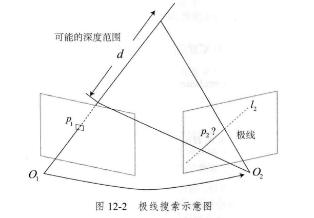

在极线上进行相似性度量，会得到沿着极线的一个相似度指标分布，一般使用概率分布来描述确定的深度值，而深度估计也可以被建模为一个概率估计问题，然后又在估计其中的不确定性。估计稠密深度的一个完整过程为：

```
1. 假设所有像素的深度满足某个初始的高斯分布。
2. 当新数据产生时，通过极线搜索和块匹配确定投影点位置。
3. 根据几何关系计算三角化后的深度及不确定性。
4. 将当前观测融合进上一次的估计中。若收敛则停止计算，否则返回第2步。
```

实践：单目稠密重建

- 数据集，`REMODE`的数据集相关研究，可以在学院官网找到链接：https://rpg.ifi.uzh.ch/software_datasets.html，但是官网数据集的下载链接失效了，另外在网上找到的下载链接为：https://www.aliyundrive.com/s/DY15VEi3pXh。
- 代码：`dense_monocular/dense_mapping.cpp`，笔记看代码文件。

运行结果：一共运行200个循环，会有一部分的问题，像书上提到的那样

- 像素梯度：打印机表面为纯白块，如果小块为白色区域里面的某个点，那么区分度不高容易引起误匹配。反映了**立体视觉依赖物体表面的纹理**，属于算法的先天缺陷，这也是目前SLAM算法虽然成熟，但是在一些特定场景中还存在**鲁棒性**需要进行研究。
- 逆深度：直接把像素梯度假设为高斯分布的参数化形式不一定合理，实际情况在用高斯分布不好描述所有点的距离，用**逆深度**会好一点，可以自己手动改逆深度。
- GPU并行化运算：这个程序是写在CPU上运行，在实验中能感受到运行的速度比较慢。


### RGB-D稠密建图

需要使用点云库PCL（Point Cloud Library）：是基于C++的点云处理库，使用的人群挺多。

- github：https://github.com/PointCloudLibrary/pcl
- 官网：https://pointclouds.org/

点云处理的库，还有一个**更现代**的：https://github.com/isl-org/Open3D，支持C++和Python。

安装PCL，推荐直接安装预编译版本

```bash
sudo apt install libpcl-dev pcl-tools
```

数据集选用ICL-NUIM，是一个仿真的RGB-D数据集。

结果可视化，使用PCL_viewer

```bash
pcl_viewer map.pcd
```

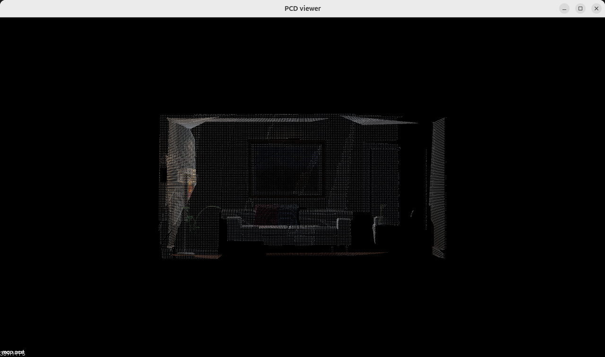

### 从点云重建网格

使用的算法是Moving Least Square 和 Greedy Projection。

```bash
./dense_RGBD/surfel_mapping map.pcd
```

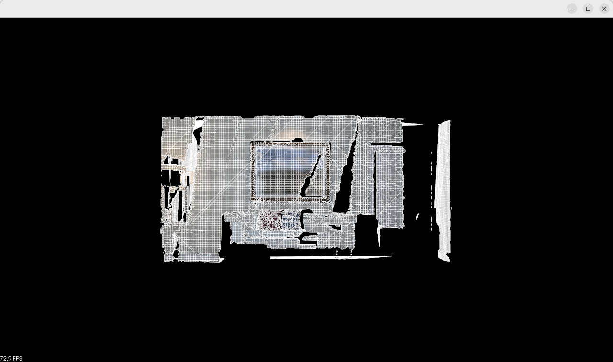

### 八叉树地图

安装`octomap`库，使用`octovis`可视化八叉树地图。

```bash
sudo apt install liboctomap-dev octovis
```

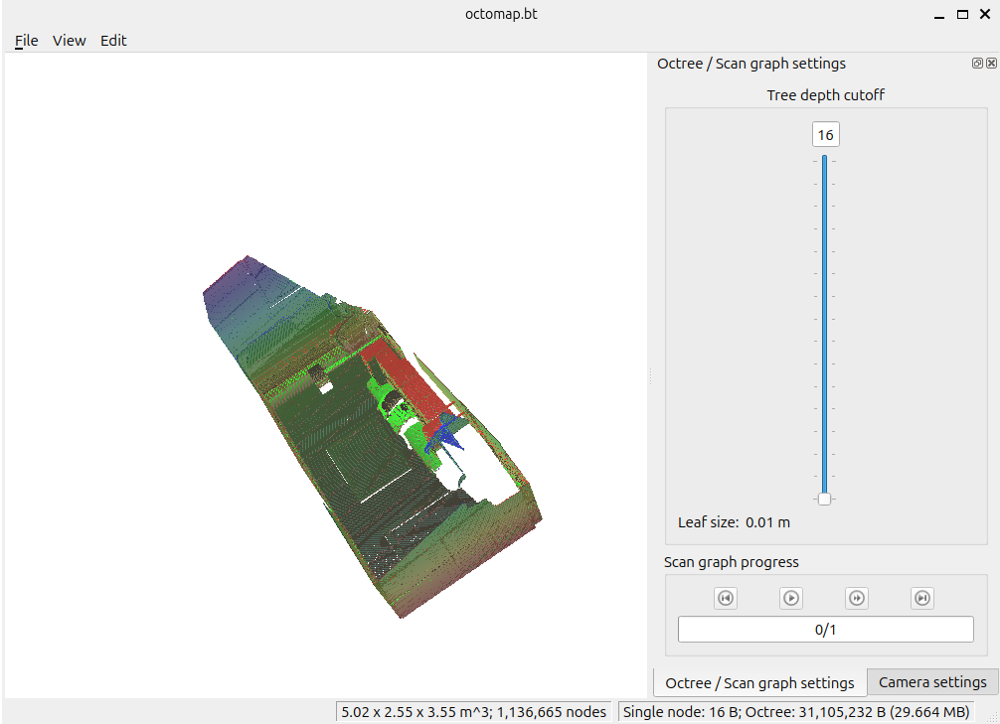

### 编译报错处理

我每次运行程序的时候总是一段一段编译，按照这篇文章中的整个进行编译：https://blog.csdn.net/qq_44164791/article/details/131284692，有些问题就不会出现，真的太抽象了。


## SLAM系统

使用到KITTI数据集，下载里程计数据，官网地址：[Download odometry data set (grayscale, 22 GB)](https://s3.eu-central-1.amazonaws.com/avg-kitti/data_odometry_gray.zip)

### 项目结构

文件夹目录：

- ch13（根目录）
  - bin：存储编译的二进制文件
  - app
    - CMakeLists.txt
    - run_kitti_sterro.cpp：主程序文件
  - cmake_modules：存放第三方库的`.cmake`文件
  - config：配置文件
    - default.yaml：整个项目的默认配置，设置数据集的文件夹路径，相机内参，提取的特征点数量
  - include/myslam：存放头文件`.h`，主要编写帧frame，相机camera，路标点mappoint，特征feature类等，定义数据结构
  - src：存放项目的源代码文件`.cpp`，编写各种类之间的交互逻辑

### 数据结构

- frame：处理的基本单元是**图像**，在双目视觉中，一般用**一帧**来代表**一对图像**，即每时刻来自两个摄像头的两张图像
- feature：每一张图片里面会提取出**特征点**
- mappoint：使用特征点来估计**路标点**

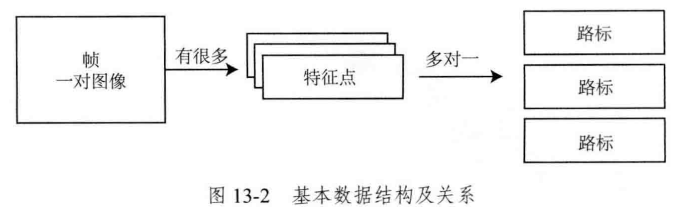

### 算法架构

区分前后端的计算任务：

- 前端：图像作为前端计算任务的输入，做里程计的任务，包括特征点追踪，位姿估计，三角化等计算
- 后端：全局优化，回环检测
- 地图：前端和后端共同更新的数据


### 报错调整

#### 找不到`gdal`和`curl`

报错：找不到`gdal`和`curl`

```bash
error:/usr/bin/ld: /lib/x86_64-linux-gnu/libgdal.so.34: undefined reference to `curl_easy_getinfo@CURL_OPENSSL_4'
```

参考[stack overflow](https://stackoverflow.com/questions/16476196/undefined-reference-to-curl-global-init-curl-easy-init-and-other-functionc)，是因为没有指定链接，在CMakeLists.txt中指定之后就可以完成

```cmake
set(CMAKE_CXX_FLAGS_RELEASE  "-std=c++17 -O3 -fopenmp -pthread -lcurl")
```

#### Segmentation fault (core dumped)

编译程序成功后，运行`./bin/run_kitti_stereo`遇到报错：核心已转储

参考博客：

- https://blog.csdn.net/sinat_39720504/article/details/102481421，但不免费
- https://blog.csdn.net/qq_39779233/article/details/128402594，免费，有两个报错

参考github issue：https://github.com/gaoxiang12/slambook2/issues/18，将config.cpp作出一定调整

但是上面的并不能解决问题，又尝试了其他的方法，但是仍然无法解决，这个Segmentation fault (core dumped)的问题似乎会出现在很多的情况中。

### 代码阅读


